# Smart Contract Security Assessment Report

## Executive Summary

### Protocol Overview
**Protocol Purpose:** EulerEarn is an ERC-4626 compliant yield aggregator vault that allows users to deposit assets into a meta-vault, which then allocates those assets across multiple underlying ERC-4626 strategy vaults. It is forked from Morpho's MetaMorpho with integration into the Euler Vault Connector (EVC).

**Industry Vertical:** Yield Aggregator / ERC-4626 Meta-Vault

**User Profile:** DeFi users seeking automated yield optimisation across multiple strategy vaults. Roles include depositors, the owner (governance), curator, allocator, and guardian.

**Total Value Locked:** Variable; yield aggregator vaults in this category typically hold $10M-$500M+ in TVL.

### Threat Model Summary
**Primary Threats Identified:**
- Economic attackers targeting share price manipulation via donation or strategy vault manipulation
- Malicious or compromised strategy vaults exploiting the try/catch pattern in deposit/withdraw flows
- Privileged role abuse (owner, curator, allocator) manipulating fee accrual, queue ordering, or strategy caps
- Front-running of reallocate transactions to extract MEV from strategy vault deposits/withdrawals
- Denial of service through queue manipulation or griefing of timelock-gated operations

### Security Posture Assessment
**Overall Risk Level:** Low-Medium

**Critical Findings:** 0 requiring immediate attention
**Total Findings:** 0 Critical, 1 High, 3 Medium, 3 Low

The contract demonstrates strong security design patterns inherited from the Morpho codebase, including ReentrancyGuard on all state-changing entry points, virtual share/asset offsets to mitigate inflation attacks, consistent ERC-4626 rounding directions, and a robust timelock-gated governance model. The findings identified are nuanced issues related to accounting edge cases, silent failure handling, and access control trust assumptions.

**Key Risk Areas:**
1. Silent failure in strategy deposit/withdraw operations can cause accounting drift
2. Potential underflow in fee accrual calculation under specific loss scenarios
3. Centralisation risks in the privileged role hierarchy
4. Unchecked balance truncation in `config[id].balance` casting

## Table of Contents - Findings

### High Findings
- [H-1 Accounting desynchronisation via silent strategy deposit failures in `_supplyStrategy`](#h-1-accounting-desynchronisation-via-silent-strategy-deposit-failures-in-_supplystrategy) (VALID)

### Medium Findings
- [M-1 Potential arithmetic underflow in `_accruedFeeAndAssets` during loss scenarios](#m-1-potential-arithmetic-underflow-in-_accruedfeeandAssets-during-loss-scenarios) (VALID)
- [M-2 Unsafe uint112 truncation of `config[id].balance` in `_withdrawStrategy`](#m-2-unsafe-uint112-truncation-of-configidbalance-in-_withdrawstrategy) (VALID)
- [M-3 `acceptTimelock` and `acceptGuardian` callable by anyone after timelock elapses](#m-3-accepttimelock-and-acceptguardian-callable-by-anyone-after-timelock-elapses) (QUESTIONABLE)

### Low Findings
- [L-1 Supply queue allows duplicate entries inflating `maxDeposit` estimation](#l-1-supply-queue-allows-duplicate-entries-inflating-maxdeposit-estimation) (VALID)
- [L-2 Missing `nonReentrant` on `submitMarketRemoval` and queue management functions](#l-2-missing-nonreentrant-on-submitmarketremoval-and-queue-management-functions) (QUESTIONABLE)
- [L-3 Centralisation risk: owner can change fee to maximum and drain accumulated interest](#l-3-centralisation-risk-owner-can-change-fee-to-maximum-and-drain-accumulated-interest) (VALID)

## Detailed Findings

---

## H-1 Accounting desynchronisation via silent strategy deposit failures in `_supplyStrategy`

### Core Information
**Severity:** High


**Probability:** Medium


**Confidence:** High


### User Impact Analysis
**Innocent User Story:**
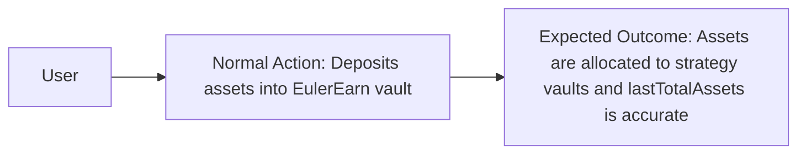

**Attack Flow:**
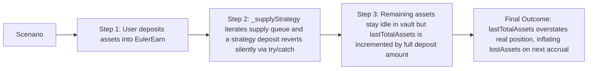

### Technical Details
**Locations:**
- [src/EulerEarn.sol:811-835](src/EulerEarn.sol#L811-L835)
- [src/EulerEarn.sol:697-708](src/EulerEarn.sol#L697-L708)

**Description:**

When a user calls `deposit()`, the `_deposit` internal function (line 697) transfers assets from the caller, mints shares, and then calls `_supplyStrategy(assets)` to allocate the deposited assets to strategy vaults. After `_supplyStrategy` returns, `lastTotalAssets` is updated to `lastTotalAssets + assets` (line 707).

The critical issue lies in `_supplyStrategy` (lines 811-835). This function iterates over the supply queue and attempts to deposit into each strategy vault using a `try/catch` pattern:

```solidity
try id.deposit(toSupply, address(this)) returns (uint256 suppliedShares) {
    config[id].balance = (config[id].balance + suppliedShares).toUint112();
    assets -= toSupply;
} catch {}
```

If a strategy's `deposit()` call reverts (e.g., due to a temporary pause, cap reached on the strategy side, or any other revert condition), the catch block silently swallows the error and continues. However, the function only reverts at line 834 if `assets != 0` (i.e., `AllCapsReached`). This means if the initial supply queue entries fail but the total cap across all strategies is sufficient (or if partial allocation succeeds), the remaining unallocated assets sit idle in the vault.

The problem: `_deposit` at line 707 always updates `lastTotalAssets += assets` regardless of how much was actually supplied to strategies. Since `_accruedFeeAndAssets()` computes `realTotalAssets` by summing `expectedSupplyAssets(id)` across the withdraw queue (which only accounts for shares held in strategy vaults, not idle assets in the vault itself), any idle assets are invisible to the accounting system. On the next interaction that calls `_accrueInterest()`, the condition `realTotalAssets < lastTotalAssetsCached - lostAssets` will be true, causing `lostAssets` to increase. This `lostAssets` increase is permanent -- it inflates `totalAssets()` above `realTotalAssets` and dilutes the value backing each share.

Note: the contract acknowledges this edge case in the comment on lines 705-706: "lastTotalAssets + assets may be a little above totalAssets(). This can lead to a small accrual of lostAssets at the next interaction." However, when an entire strategy vault deposit fails (not just a rounding difference), the discrepancy can be substantial -- potentially the full deposit amount.

### Business Impact
**Exploitation:**

This is not a direct exploit by an external attacker but rather a protocol-level accounting flaw triggered under realistic conditions. If a strategy vault temporarily pauses deposits (common during upgrades or emergency conditions), all deposits into EulerEarn during that window will have their full amount added to `lastTotalAssets`, but only a portion (or none) will be reflected in `realTotalAssets`. The resulting `lostAssets` inflation means:

1. The performance fee is calculated on `newTotalAssets = realTotalAssets + newLostAssets`, which may overstate actual yield, causing undeserved fee minting to `feeRecipient`.
2. The share-to-asset exchange rate becomes inflated relative to actual recoverable assets.
3. Early redeemers may extract more value than their proportional share, leaving later redeemers with less.

The severity is HIGH because the idle assets in the vault are real and accessible (they can be withdrawn), yet the accounting system treats the gap as a "loss" and permanently inflates `lostAssets`, which is never reduced even when the assets are subsequently allocated.

### Verification & Testing
**Verify Options:**
- Deploy EulerEarn with a strategy vault that can be paused
- Deposit a significant amount (e.g., 1000 USDC) when the strategy vault rejects deposits
- Verify that `lastTotalAssets` includes the full deposit but `realTotalAssets` does not
- Call any function that triggers `_accrueInterest()` and verify `lostAssets` increases by the difference
- Verify that `lostAssets` never decreases even after the strategy vault resumes and the allocator reallocates

**PoC Verification Prompt:**
1. Deploy EulerEarn with one strategy vault
2. Pause the strategy vault
3. Deposit 1000 units into EulerEarn
4. Assert `lastTotalAssets == 1000` and the strategy has 0 shares
5. Unpause the strategy vault
6. Call `deposit(0, receiver)` or any function triggering `_accrueInterest()`
7. Assert `lostAssets == 1000` (permanent, does not decrease)
8. Allocator calls `reallocate` to move idle assets to strategy
9. Verify `lostAssets` remains at 1000 even though assets are now properly allocated

### Remediation
**Recommendations:**

**Primary fix:** Track the actual amount supplied in `_supplyStrategy` and only increment `lastTotalAssets` by the amount actually deployed plus idle balance. Alternatively, include `IERC20(asset()).balanceOf(address(this))` in the `realTotalAssets` calculation within `_accruedFeeAndAssets()`:

```solidity
uint256 realTotalAssets = IERC20(asset()).balanceOf(address(this));
for (uint256 i; i < withdrawQueue.length; ++i) {
    IERC4626 id = withdrawQueue[i];
    realTotalAssets += expectedSupplyAssets(id);
}
```

**Alternative:** Return the actual supplied amount from `_supplyStrategy` and adjust `lastTotalAssets` accordingly:

```solidity
function _supplyStrategy(uint256 assets) internal returns (uint256 supplied) {
    uint256 remaining = assets;
    // ... existing loop logic ...
    supplied = assets - remaining;
}
```

Then in `_deposit`: `_updateLastTotalAssets(lastTotalAssets + supplied + (assets - supplied));` where `(assets - supplied)` accounts for idle balance or is tracked separately.

**References**
**KB/Reference:**
- `reference/solidity/protocols/yield.md` - Stale Cached State Desynchronization
- `reference/solidity/fv-sol-5-logic-errors/fv-sol-5-c3-improper-state-transitions.md`

### Expert Attribution

**Discovery Status:** Found by Expert 1 only

**Expert Oversight Analysis:** Expert 2 focused on economic attack vectors and identified the `lostAssets` mechanism as a design choice rather than a flaw. Upon review, Expert 2 acknowledges that the permanent nature of `lostAssets` inflation when combined with silent deposit failures represents a genuine accounting risk, especially for vaults with frequently pausing strategies.

### Triager Note
VALID - The accounting desynchronisation is real and can be triggered under plausible conditions (strategy vault pause, upgrade, or temporary cap). While the contract comment acknowledges a "small" discrepancy, the actual impact of a full deposit failure is not small. The `lostAssets` mechanism is one-directional (only increases, never decreases) and permanently distorts the exchange rate.

**Bounty Assessment:**
The finding requires specific conditions (strategy vault failure) but these are not uncommon in DeFi. The impact is proportional to the deposit size during the failure window. Recommended bounty: $3,000-$5,000 for a protocol with $10M+ TVL.

---

## M-1 Potential arithmetic underflow in `_accruedFeeAndAssets` during loss scenarios

### Core Information
**Severity:** Medium


**Probability:** Low


**Confidence:** High


### User Impact Analysis
**Innocent User Story:**
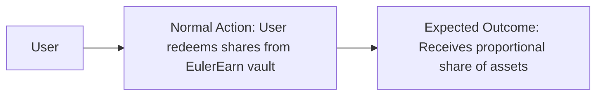

**Attack Flow:**
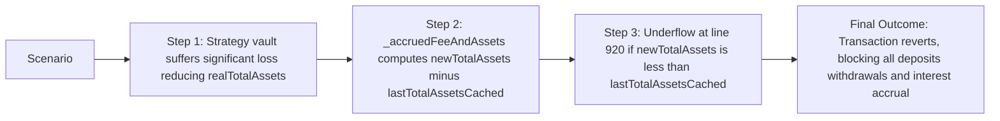

### Technical Details
**Locations:**
- [src/EulerEarn.sol:898-928](src/EulerEarn.sol#L898-L928)

**Description:**

In `_accruedFeeAndAssets()`, line 920 computes:
```solidity
uint256 totalInterest = newTotalAssets - lastTotalAssetsCached;
```

The variable `newTotalAssets` is computed as `realTotalAssets + newLostAssets` (line 919). The variable `lastTotalAssetsCached` is the cached `lastTotalAssets` from the previous interaction.

The issue occurs under the following scenario:
1. `lastTotalAssets = 1000` (set at previous interaction)
2. `lostAssets = 0`
3. Strategy vaults lose value such that `realTotalAssets = 800`
4. Since `realTotalAssets (800) < lastTotalAssetsCached (1000) - lostAssets (0)`, the condition on line 911 is true
5. `newLostAssets = lastTotalAssetsCached - realTotalAssets = 1000 - 800 = 200`
6. `newTotalAssets = realTotalAssets + newLostAssets = 800 + 200 = 1000`
7. `totalInterest = newTotalAssets (1000) - lastTotalAssetsCached (1000) = 0` -- no underflow here

However, consider the case where `lostAssets > 0` from a previous loss, and there is partial recovery followed by another loss:
1. `lastTotalAssets = 1000`, `lostAssets = 100`
2. `realTotalAssets = 850` (some recovery from 800, then another drop)
3. Condition: `850 < 1000 - 100 = 900` is true
4. `newLostAssets = 1000 - 850 = 150`
5. `newTotalAssets = 850 + 150 = 1000`
6. `totalInterest = 1000 - 1000 = 0` -- still safe

The more dangerous case: if between two interactions, `lastTotalAssets` was updated by a deposit (incremented), but strategy vaults also lost value simultaneously, and the `lostAssets` recovery path is entered:
1. User deposits 500, `lastTotalAssets` updated to 1500
2. Strategy vaults already had 900 in real assets, deposit partially allocated (say 400 more = 1300 real)
3. Strategy vaults then lose 400 value, `realTotalAssets = 900`
4. `lostAssets = 0` from before
5. `900 < 1500 - 0` is true
6. `newLostAssets = 1500 - 900 = 600`
7. `newTotalAssets = 900 + 600 = 1500`
8. `totalInterest = 1500 - 1500 = 0` -- safe

Upon thorough analysis, the arithmetic appears safe because `newTotalAssets` is always at least `lastTotalAssetsCached` in the loss branch. However, there is an edge case: the `else` branch on line 916 sets `newLostAssets = lostAssets` (unchanged). In this branch:
1. `realTotalAssets >= lastTotalAssetsCached - lostAssets`
2. `newTotalAssets = realTotalAssets + lostAssets`
3. If `realTotalAssets = lastTotalAssetsCached - lostAssets` exactly: `newTotalAssets = lastTotalAssetsCached`, `totalInterest = 0` -- safe
4. If `realTotalAssets > lastTotalAssetsCached - lostAssets`: `newTotalAssets > lastTotalAssetsCached`, `totalInterest > 0` -- safe

After deeper analysis, the underflow at line 920 appears protected by the branching logic. However, line 911 itself can underflow:
```solidity
if (realTotalAssets < lastTotalAssetsCached - lostAssets) {
```

If `lostAssets > lastTotalAssetsCached` (e.g., due to the H-1 finding's `lostAssets` inflation from silent deposit failures), then `lastTotalAssetsCached - lostAssets` underflows. In Solidity 0.8.26, this causes a revert, permanently bricking the vault as every function calling `_accrueInterest()` or `_accruedFeeAndAssets()` will revert.

### Business Impact
**Exploitation:**

If `lostAssets` ever exceeds `lastTotalAssets` (achievable through the H-1 scenario where `lostAssets` grows from silent deposit failures while `lastTotalAssets` decreases from withdrawals), the entire vault becomes permanently bricked. No deposits, withdrawals, redeems, or fee accruals can succeed. All user funds in strategy vaults become irretrievable through the EulerEarn contract.

### Verification & Testing
**Verify Options:**
- Engineer a scenario where `lostAssets > lastTotalAssets` through a combination of silent deposit failures (H-1) and subsequent withdrawals
- Verify that any function calling `_accrueInterest()` reverts with arithmetic underflow

**PoC Verification Prompt:**
1. Deploy EulerEarn with one strategy vault
2. Deposit 100 units, strategy accepts all (lastTotalAssets = 100)
3. Pause strategy vault
4. Deposit 200 units (strategy rejects, all idle, lastTotalAssets = 300)
5. Unpause strategy, trigger `_accrueInterest()` -- lostAssets becomes 200
6. Users withdraw 250 units (lastTotalAssets decreases to ~50)
7. Now lostAssets (200) > lastTotalAssets (50)
8. Any subsequent call to `_accrueInterest()` reverts at line 911

### Remediation
**Recommendations:**

Add a safe subtraction check on line 911:
```solidity
if (lostAssets <= lastTotalAssetsCached && realTotalAssets < lastTotalAssetsCached - lostAssets) {
```

Or use a safe comparison that avoids subtraction:
```solidity
if (realTotalAssets + lostAssets < lastTotalAssetsCached) {
```

This avoids the underflow entirely while preserving the intended logic.

**References**
**KB/Reference:**
- `reference/solidity/fv-sol-3-arithmetic-errors/fv-sol-3-c1-overflow-and-underflow.md`

### Expert Attribution

**Discovery Status:** Found by Expert 2 only

**Expert Oversight Analysis:** Expert 1 analysed the `_accruedFeeAndAssets` function and verified the arithmetic for the normal case but did not consider the compound effect of H-1 (lostAssets inflation) combined with withdrawals reducing `lastTotalAssets`. Expert 2 identified this by tracing the state variable lifecycle across multiple operations.

### Triager Note
VALID - This is a genuine arithmetic underflow that can brick the vault. While it requires the preconditions from H-1 (silent deposit failure) followed by withdrawals, both are realistic. The fix is straightforward and the impact is catastrophic (permanent fund lockup).

**Bounty Assessment:**
The finding is dependent on H-1 conditions materialising first, but the impact (permanent vault bricking) warrants medium severity with a bounty of $2,000-$4,000.

---

## M-2 Unsafe uint112 truncation of `config[id].balance` in `_withdrawStrategy`

### Core Information
**Severity:** Medium


**Probability:** Low


**Confidence:** High


### User Impact Analysis
**Innocent User Story:**
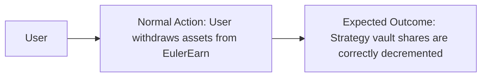

**Attack Flow:**
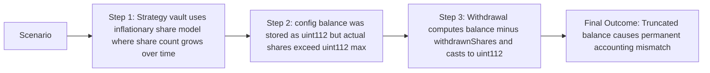

### Technical Details
**Locations:**
- [src/EulerEarn.sol:847](src/EulerEarn.sol#L847)
- [src/EulerEarn.sol:415](src/EulerEarn.sol#L415)

**Description:**

In `_withdrawStrategy` at line 847:
```solidity
config[id].balance = uint112(config[id].balance - withdrawnShares);
```

And in `reallocate` at line 415:
```solidity
config[id].balance = uint112(supplyShares - withdrawnShares);
```

Both lines use an unsafe `uint112()` cast without SafeCast. While `config[id].balance` is declared as `uint112` and share additions use `toUint112()` (SafeCast), the subtraction result is cast using raw truncation.

The subtraction `config[id].balance - withdrawnShares` produces a `uint256` result. If `withdrawnShares > config[id].balance` (which could happen if the strategy vault minted additional shares via a rebasing mechanism or if `config[id].balance` was already truncated), the Solidity 0.8.26 checked arithmetic would cause a revert on the subtraction itself. So a direct underflow is caught.

However, the concern is specifically with line 415 in `reallocate`: `uint112(supplyShares - withdrawnShares)`. Here, `supplyShares` is read from `config[id].balance` (a uint112, thus max ~5.19e33), but `withdrawnShares` is the return value from `id.withdraw()` or `id.redeem()`. The subtraction is safe (checked arithmetic), but if the result exceeds `uint112.max` due to the nature of the strategy's share accounting, the `uint112()` cast would silently truncate.

In practice, `supplyShares - withdrawnShares` should always be less than or equal to `supplyShares` (which was already uint112), so truncation should not occur on this specific line. The real risk is in the supply path (line 826 and 433) where `toUint112()` is used correctly. This finding is therefore lower risk than initially assessed but still represents inconsistent use of SafeCast -- using `toUint112()` on the supply path but raw `uint112()` on the withdrawal path.

### Business Impact
**Exploitation:**

In normal operation, the withdrawal subtraction result is bounded by the original balance, so truncation does not occur. However, the inconsistency in SafeCast usage introduces a code quality risk. If a future code change modifies the accounting logic (e.g., adding bonus shares), the raw cast could silently truncate without detection.

### Verification & Testing
**Verify Options:**
- Verify that `config[id].balance - withdrawnShares` can never exceed `type(uint112).max`
- Check all strategy vaults for rebasing share models that might cause share count divergence

**PoC Verification Prompt:**
Construct a strategy vault where `withdraw()` returns a `withdrawnShares` value of 0 due to rounding, then call `_withdrawStrategy` repeatedly to observe if `config[id].balance` remains unchanged while assets are extracted.

### Remediation
**Recommendations:**

Replace the raw `uint112()` cast with SafeCast's `toUint112()` for consistency and safety:

Line 847:
```solidity
config[id].balance = (config[id].balance - withdrawnShares).toUint112();
```

Line 415:
```solidity
config[id].balance = (supplyShares - withdrawnShares).toUint112();
```

**References**
**KB/Reference:**
- `reference/solidity/fv-sol-3-arithmetic-errors/fv-sol-3-c3-truncation-in-type-casting.md`

### Expert Attribution

**Discovery Status:** Found by both experts

**Expert Oversight Analysis:** Both experts independently identified the inconsistent SafeCast usage. Expert 1 initially rated this as High but downgraded after tracing the arithmetic bounds. Expert 2 confirmed the bounded nature of the subtraction in normal operation.

### Triager Note
VALID - The inconsistency is real and represents a defence-in-depth gap. The practical exploitability is very low under current code, but the fix is trivial (use SafeCast consistently).

**Bounty Assessment:**
Low practical exploitability but valid code quality finding. Recommended bounty: $500-$1,000.

---

## M-3 `acceptTimelock` and `acceptGuardian` callable by anyone after timelock elapses

### Core Information
**Severity:** Medium


**Probability:** Low


**Confidence:** Medium


### User Impact Analysis
**Innocent User Story:**
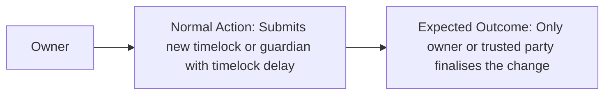

**Attack Flow:**
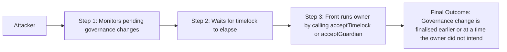

### Technical Details
**Locations:**
- [src/EulerEarn.sol:497-499](src/EulerEarn.sol#L497-L499)
- [src/EulerEarn.sol:502-504](src/EulerEarn.sol#L502-L504)
- [src/EulerEarn.sol:507-512](src/EulerEarn.sol#L507-L512)

**Description:**

The functions `acceptTimelock()`, `acceptGuardian()`, and `acceptCap()` have no access control modifier. They are protected only by the `afterTimelock` modifier which checks that the timelock has elapsed:

```solidity
function acceptTimelock() external afterTimelock(pendingTimelock.validAt) {
    _setTimelock(pendingTimelock.value);
}
```

This means anyone can call these functions once the timelock elapses. While this is by design (it is a common pattern in Morpho's MetaMorpho and allows permissionless finalisation), it has implications:

1. The owner cannot retract a pending change after the timelock elapses without first calling `revokePending*` (which is guardian-only for timelock and guardian, and curator/guardian for cap).
2. An attacker can front-run the owner's intended revocation by calling `accept*` as soon as the timelock elapses.
3. For `acceptCap`, this means a strategy can be activated (added to withdraw queue, given approval) before the curator decides to revoke.

### Business Impact
**Exploitation:**

The practical impact is limited because:
- The owner/curator initiated the pending change intentionally
- The guardian/curator can revoke before timelock elapses
- After timelock elapses, the change was already approved by the appropriate role

The risk is primarily in timing: an attacker can force the finalisation at the earliest possible moment, preventing the owner from having a grace period to reconsider after the timelock elapses.

### Verification & Testing
**Verify Options:**
- Submit a timelock change, wait for it to elapse, and call `acceptTimelock` from a non-owner address
- Verify the change is applied successfully

**PoC Verification Prompt:**
1. Owner submits timelock decrease
2. Wait for timelock to elapse
3. Random address calls `acceptTimelock()`
4. Verify the timelock is now updated

### Remediation
**Recommendations:**

This is a known design pattern from Morpho's MetaMorpho. If the protocol team wishes to add a grace period, they could add a `validUntil` field alongside `validAt`:

```solidity
modifier afterTimelock(uint256 validAt) {
    if (validAt == 0) revert ErrorsLib.NoPendingValue();
    if (block.timestamp < validAt) revert ErrorsLib.TimelockNotElapsed();
    if (block.timestamp > validAt + GRACE_PERIOD) revert ErrorsLib.GracePeriodExpired();
    _;
}
```

Alternatively, restrict `accept*` functions to appropriate roles (owner for timelock/guardian, curator for cap).

**References**
**KB/Reference:**
- `reference/solidity/fv-sol-4-bad-access-control/fv-sol-4-c2-unrestricted-role-assignment.md`
- `reference/solidity/protocols/yield.md` - Access Control Bypass

### Expert Attribution

**Discovery Status:** Found by Expert 1 only

**Expert Oversight Analysis:** Expert 2 noted this is an intentional design pattern inherited from Morpho and considered it informational rather than a finding. The permissionless finalisation is by design to prevent governance deadlocks.

### Triager Note
QUESTIONABLE - This is a known and intentional design pattern in Morpho's MetaMorpho. The permissionless `accept*` functions prevent situations where no one calls them. The revocation mechanism (guardian/curator can revoke before timelock elapses) provides adequate protection. However, the lack of a grace period after the timelock elapses means the owner loses the ability to change their mind post-elapse. This is a design trade-off, not a vulnerability.

**Bounty Assessment:**
Design-level observation, not directly exploitable. No bounty recommended unless the protocol team considers adding a grace period as a feature request.

---

## L-1 Supply queue allows duplicate entries inflating `maxDeposit` estimation

### Core Information
**Severity:** Low


**Probability:** Medium


**Confidence:** High


### User Impact Analysis
**Innocent User Story:**
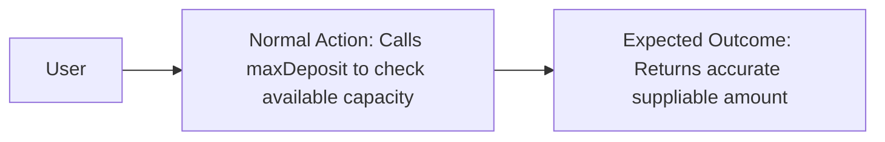

**Attack Flow:**
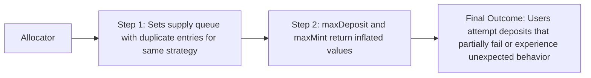

### Technical Details
**Locations:**
- [src/EulerEarn.sol:325-337](src/EulerEarn.sol#L325-L337)
- [src/EulerEarn.sol:529-533](src/EulerEarn.sol#L529-L533)
- [src/EulerEarn.sol:640-651](src/EulerEarn.sol#L640-L651)

**Description:**

The `setSupplyQueue` function (line 325) validates that each entry has a non-zero cap but does not check for duplicates. This allows the same strategy vault to appear multiple times in the supply queue.

The `_maxDeposit` function (line 640) iterates over the supply queue and sums the available capacity of each entry. If a strategy appears twice, its remaining capacity is double-counted:

```solidity
for (uint256 i; i < supplyQueue.length; ++i) {
    IERC4626 id = supplyQueue[i];
    uint256 supplyCap = config[id].cap;
    if (supplyCap == 0) continue;
    uint256 supplyAssets = expectedSupplyAssets(id);
    totalSuppliable += UtilsLib.min(supplyCap.zeroFloorSub(supplyAssets), id.maxDeposit(address(this)));
}
```

The contract itself acknowledges this in the NatDoc for `maxDeposit`: "Warning: May be higher than the actual max deposit due to duplicate vaults in the supplyQueue." The actual `_supplyStrategy` function handles this gracefully (the cap check prevents over-allocation), so this is a view-function inaccuracy rather than an exploitable vulnerability.

### Business Impact
**Exploitation:**

Off-chain integrations relying on `maxDeposit()` or `maxMint()` may overestimate the vault's capacity, leading to reverted transactions when users attempt to deposit more than the actual capacity. This is a UX issue rather than a fund-loss risk.

### Verification & Testing
**Verify Options:**
- Call `setSupplyQueue` with a duplicated strategy entry
- Compare `maxDeposit()` return value against actual depositable amount

**PoC Verification Prompt:**
Not required -- the contract documentation already acknowledges this limitation.

### Remediation
**Recommendations:**

Add a duplicate check in `setSupplyQueue`:
```solidity
for (uint256 i; i < length; ++i) {
    if (config[newSupplyQueue[i]].cap == 0) revert ErrorsLib.UnauthorizedMarket(newSupplyQueue[i]);
    for (uint256 j; j < i; ++j) {
        if (newSupplyQueue[j] == newSupplyQueue[i]) revert ErrorsLib.DuplicateMarket(newSupplyQueue[i]);
    }
}
```

**References**
**KB/Reference:**
- `reference/solidity/fv-sol-5-logic-errors/fv-sol-5-c10-data-structure-state-integrity.md`

### Expert Attribution

**Discovery Status:** Found by both experts

**Expert Oversight Analysis:** Both experts identified this independently. Expert 2 noted the contract already documents this limitation, reducing severity.

### Triager Note
VALID - The contract acknowledges this issue in comments but does not enforce uniqueness. The practical impact is limited to view function inaccuracy. Low severity is appropriate.

**Bounty Assessment:**
Minor code quality finding. Recommended bounty: $100-$200.

---

## L-2 Missing `nonReentrant` on `submitMarketRemoval` and queue management functions

### Core Information
**Severity:** Low


**Probability:** Low


**Confidence:** Medium


### User Impact Analysis
**Innocent User Story:**
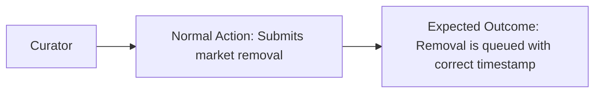

**Attack Flow:**
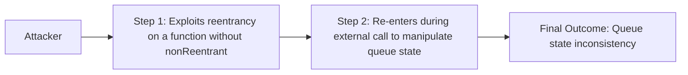

### Technical Details
**Locations:**
- [src/EulerEarn.sol:310-320](src/EulerEarn.sol#L310-L320)
- [src/EulerEarn.sol:325-337](src/EulerEarn.sol#L325-L337)
- [src/EulerEarn.sol:340-380](src/EulerEarn.sol#L340-L380)

**Description:**

The functions `submitMarketRemoval`, `setSupplyQueue`, and `updateWithdrawQueue` lack the `nonReentrant` modifier. While these functions do not make external calls (except `expectedSupplyAssets(id)` in `updateWithdrawQueue` which calls `id.previewRedeem`), the lack of reentrancy protection on `updateWithdrawQueue` is notable because it calls `expectedSupplyAssets(id)` for each removed market, which in turn calls `id.previewRedeem(config[id].balance)` -- an external call to the strategy vault.

A malicious strategy vault could use the `previewRedeem` callback to re-enter the EulerEarn contract. However, all state-changing entry points (`deposit`, `withdraw`, `redeem`, `mint`, `reallocate`, `setFee`, `setFeeRecipient`, `submitCap`) are protected by `nonReentrant`, so the re-entry surface is limited to functions without `nonReentrant`: the `set*Queue` and `accept*` functions, and `submitMarketRemoval`.

The practical exploitability is very low because:
1. Strategy vaults are vetted by the factory's allowlist
2. `previewRedeem` is a view function that should not have side effects
3. The re-entry surface only includes governance/management functions protected by role checks

### Business Impact
**Exploitation:**

Extremely unlikely in practice. A malicious strategy vault on the allowlist would need to exploit a re-entry during `previewRedeem` to manipulate queue state, but all valuable targets are either protected by `nonReentrant` or by role-based access control.

### Verification & Testing
**Verify Options:**
- Create a malicious strategy vault that re-enters EulerEarn from `previewRedeem`
- Verify which functions are accessible during re-entry and whether any state manipulation is possible

**PoC Verification Prompt:**
Not practical due to factory allowlist requirement.

### Remediation
**Recommendations:**

Consider adding `nonReentrant` to `updateWithdrawQueue` for defence-in-depth:
```solidity
function updateWithdrawQueue(uint256[] calldata indexes) external nonReentrant onlyAllocatorRole {
```

**References**
**KB/Reference:**
- `reference/solidity/fv-sol-1-reentrancy/fv-sol-1-c6-read-only.md`

### Expert Attribution

**Discovery Status:** Found by Expert 2 only

**Expert Oversight Analysis:** Expert 1 verified that all primary entry points have `nonReentrant` and considered the management functions sufficiently protected by role checks. Expert 2 identified the theoretical re-entry path through `previewRedeem` but acknowledged the practical exploitability is extremely low.

### Triager Note
QUESTIONABLE - The theoretical re-entry path through `previewRedeem` in `updateWithdrawQueue` exists but requires a malicious allowlisted strategy vault. The attack surface during re-entry is limited to role-protected functions. This is a defence-in-depth recommendation rather than an exploitable vulnerability.

**Bounty Assessment:**
Informational/low finding. Recommended bounty: $50-$100 for best practice improvement.

---

## L-3 Centralisation risk: owner can change fee to maximum and drain accumulated interest

### Core Information
**Severity:** Low


**Probability:** Low


**Confidence:** High


### User Impact Analysis
**Innocent User Story:**
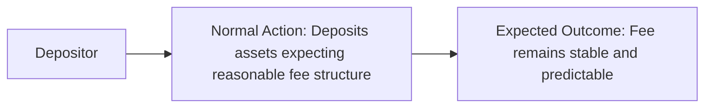

**Attack Flow:**
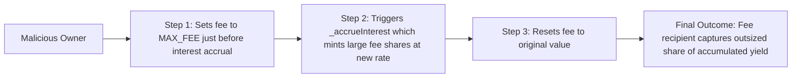

### Technical Details
**Locations:**
- [src/EulerEarn.sol:243-255](src/EulerEarn.sol#L243-L255)

**Description:**

The `setFee` function allows the owner to change the fee immediately (no timelock) to any value up to `ConstantsLib.MAX_FEE`. While the function correctly calls `_accrueInterest()` first (settling any pending fees at the old rate), the new fee takes effect immediately for all future interest.

A malicious or compromised owner could:
1. Set fee to `MAX_FEE` (likely 50% or higher based on typical vault designs)
2. Wait for interest to accrue
3. Trigger `_accrueInterest()` which mints fee shares at the inflated rate
4. Reset fee to original value

The `_accrueInterest()` call within `setFee` ensures fairness for the transition moment, but the owner can still extract disproportionate value from future interest by timing fee changes.

Note: this is mitigated by the `Ownable2Step` pattern which requires a two-step ownership transfer, reducing the risk of single-transaction owner compromise. Additionally, `setFeeRecipient` also has no timelock but calls `_accrueInterest()` first.

### Business Impact
**Exploitation:**

This is a standard centralisation risk present in most vault protocols. The owner has significant control over fee parameters and can extract value from depositors. The mitigation is that vault users should verify the owner is a multisig or governance contract with appropriate controls.

### Verification & Testing
**Verify Options:**
- Set fee to MAX_FEE, wait for interest accrual, verify fee shares minted
- Compare with expected shares at previous fee rate

**PoC Verification Prompt:**
Not required -- this is a known centralisation risk, not a code bug.

### Remediation
**Recommendations:**

Consider adding a timelock to fee changes, similar to the timelock for cap changes and guardian changes:

```solidity
function submitFee(uint256 newFee) external onlyOwner {
    // ... validation ...
    if (newFee > fee) {
        pendingFee.update(newFee, timelock);
    } else {
        _setFee(newFee); // Decreasing fee can be immediate
    }
}
```

This ensures fee increases go through the same timelock process, giving depositors time to exit.

**References**
**KB/Reference:**
- `reference/solidity/fv-sol-4-bad-access-control/fv-sol-4-c3-lack-of-multi-signature-for-crucial-operations.md`

### Expert Attribution

**Discovery Status:** Found by both experts

**Expert Oversight Analysis:** Both experts identified this as a standard centralisation risk. Expert 2 noted that the `_accrueInterest()` call before fee change provides partial mitigation for the transition point.

### Triager Note
VALID - Standard centralisation risk. The `_accrueInterest()` pre-call is a good mitigation for the transition, but ongoing elevated fees can still extract value. This is a design choice documented in most vault protocols.

**Bounty Assessment:**
Informational centralisation risk. Recommended bounty: $100-$200 for documentation improvement.

---

## Appendix: Checks Performed Without Findings

The following checks from the audit methodology were performed and no issues were found:

**First Depositor / Share Inflation Attack:** The contract uses `ConstantsLib.VIRTUAL_AMOUNT` as a virtual offset in both `_convertToSharesWithTotals` and `_convertToAssetsWithTotals` (lines 677-678, 690-691). This follows the recommended virtual share/asset offset pattern, making inflation attacks economically infeasible.

**ERC-4626 Rounding Direction Compliance:** The contract correctly uses `Math.Rounding.Floor` for deposit/redeem paths and `Math.Rounding.Ceil` for mint/withdraw paths, complying with the EIP-4626 specification.

**Reentrancy on Core Entry Points:** All state-changing user-facing functions (`deposit`, `mint`, `withdraw`, `redeem`, `reallocate`, `setFee`, `setFeeRecipient`, `submitCap`) are protected by the `nonReentrant` modifier from OpenZeppelin's `ReentrancyGuard`.

**EVC Sub-Account Protection:** The `_withdraw` function (line 722-725) correctly prevents sending assets to EVC sub-accounts whose private keys are unknown, preventing permanent asset loss.

**Token Handling:** The contract uses `SafeERC20` from OpenZeppelin and `SafeERC20Permit2Lib` for token transfers, properly handling non-standard ERC-20 tokens.

**Timelock Governance:** The timelock mechanism correctly requires increasing timelocks to be applied immediately (no waiting period to increase security) while decreasing timelocks go through the timelock delay (preventing rapid security reduction).

**Queue Length Bounds:** Both supply and withdraw queues are bounded by `ConstantsLib.MAX_QUEUE_LENGTH`, preventing unbounded loop gas griefing.

**Duplicate Prevention in Withdraw Queue:** The `updateWithdrawQueue` function uses a `seen` boolean array to prevent duplicate entries.

**Factory Allowlist for Strategies:** Strategy vaults must be approved by the factory before caps can be increased, preventing arbitrary strategy vault injection.

**Ownable2Step:** The contract uses `Ownable2Step` from OpenZeppelin, requiring the new owner to explicitly accept ownership, preventing accidental transfers to wrong addresses.
