# Smart contract security assessment report

## Executive summary

### Protocol overview
**Protocol purpose:** YieldNest ynRWAx is a multi-asset ERC4626 vault designed to manage real-world asset (RWA) exposure. It allows users to deposit multiple supported assets, receive vault shares, and benefit from RWA yield strategies managed by permissioned operators.

**Industry vertical:** Yield farming / ERC-4626 vault / RWA tokenisation

**User profile:** Institutional and retail depositors seeking RWA yield exposure through a vault abstraction layer. Vault operators (processors) manage strategy allocation. Fee managers control withdrawal fees.

**Total value locked:** Not publicly disclosed; assessed as a production vault on Ethereum mainnet.

### Threat model summary
**Primary threats identified:**
- Economic attackers targeting share price manipulation via the provider oracle or direct token donation
- Processor role holders executing arbitrary calls through the processor guard system
- Hook contract abuse enabling unrestricted share minting or state manipulation
- Withdrawal fee gaming through per-user fee overrides
- Stale totalAssets cache leading to mispriced deposits and withdrawals

### Security posture assessment
**Overall risk level:** Medium

**Total findings:** 0 Critical, 3 High, 4 Medium, 4 Low

**Key risk areas:**
1. Processor guard bypass allowing unchecked arbitrary calls via the vault
2. Hook contract trust model enabling unrestricted share minting
3. Withdrawal fee absence on the `withdrawAsset` privileged path
4. Stale cached totalAssets exploitable for share price arbitrage

## Table of contents - findings

### High findings
- [H-1 Unrestricted share minting via hooks contract trust model](#h-1-unrestricted-share-minting-via-hooks-contract-trust-model) (VALID)
- [H-2 Processor guard bypass via non-ADDRESS parameter types](#h-2-processor-guard-bypass-via-non-address-parameter-types) (VALID)
- [H-3 Withdrawal fee bypass on privileged withdrawAsset path](#h-3-withdrawal-fee-bypass-on-privileged-withdrawasset-path) (VALID)

### Medium findings
- [M-1 Stale totalAssets cache exploitable for share price arbitrage](#m-1-stale-totalassets-cache-exploitable-for-share-price-arbitrage) (VALID)
- [M-2 processAccounting is permissionless and manipulable via donation](#m-2-processaccounting-is-permissionless-and-manipulable-via-donation) (VALID)
- [M-3 Public fee functions expose internal accounting to external manipulation](#m-3-public-fee-functions-expose-internal-accounting-to-external-manipulation) (QUESTIONABLE)
- [M-4 Provider oracle single point of failure with no staleness check](#m-4-provider-oracle-single-point-of-failure-with-no-staleness-check) (VALID)

### Low findings
- [L-1 First depositor inflation attack partially mitigated but not eliminated](#l-1-first-depositor-inflation-attack-partially-mitigated-but-not-eliminated) (VALID)
- [L-2 Receive function accepts native ETH without share accounting](#l-2-receive-function-accepts-native-eth-without-share-accounting) (VALID)
- [L-3 Guard parameter validation only checks ADDRESS type, skipping UINT256](#l-3-guard-parameter-validation-only-checks-address-type-skipping-uint256) (VALID)
- [L-4 deleteAsset uses swap-and-pop which may break external index assumptions](#l-4-deleteasset-uses-swap-and-pop-which-may-break-external-index-assumptions) (QUESTIONABLE)

---

## Detailed findings

---

## H-1 Unrestricted share minting via hooks contract trust model

### Core information
**Severity:** High

**Probability:** Medium

**Confidence:** High

### User impact analysis
**Innocent user story:**
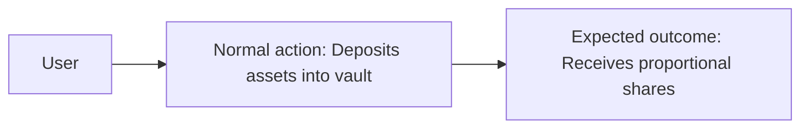

**Attack flow:**
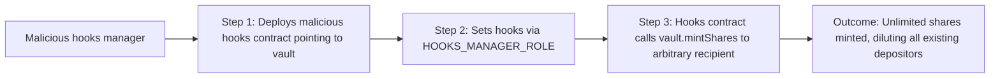

### Technical details
**Locations:**
- [src/BaseVault.sol:970-976](src/BaseVault.sol#L970-L976)
- [src/BaseVault.sol:982-987](src/BaseVault.sol#L982-L987)

**Description:**
The `mintShares` function on BaseVault allows the configured hooks contract to mint an arbitrary number of shares to any recipient without any corresponding asset deposit or totalAssets update:

```solidity
function mintShares(address recipient, uint256 shares) external {
    if (msg.sender != address(hooks())) {
        revert CallerNotHooks();
    }
    _mint(recipient, shares);
}
```

The only access control is `msg.sender == address(hooks())`. The hooks contract is set by the `HOOKS_MANAGER_ROLE`. If the hooks manager sets a malicious hooks contract (or if the hooks contract itself has a vulnerability), it can call `mintShares` to inflate the share supply without any asset backing. This dilutes all existing shareholders proportionally.

Critically, `mintShares` does not call `_addTotalAssets`, meaning the share-to-asset ratio changes immediately upon minting. The `totalAssets` remains the same while `totalSupply` increases, causing the share price to drop. All existing depositors lose value proportional to the inflated supply.

Additionally, `setHooks` validates that `IHooks(hooks_).VAULT() == address(this)` but does not validate the hooks contract's implementation beyond this. Any contract that returns the correct vault address passes this check.

### Business impact
**Exploitation:**
A compromised or malicious hooks manager can permanently dilute vault shareholders by minting shares to a controlled address. The hooks contract could mint shares in an `afterDeposit` callback, effectively stealing a portion of every deposit. If the hooks contract is upgradeable, a compromised admin key could deploy a malicious implementation at any time. Given that this is a production vault managing RWA assets, the impact could be substantial loss of depositor funds through share dilution.

### Verification and testing
**Verify options:**
- Confirm whether the hooks contract is upgradeable and what access controls govern its admin
- Review the deployed hooks contract implementation for any path that calls `mintShares`
- Verify whether HOOKS_MANAGER_ROLE is held behind a timelock or multisig

**PoC verification prompt:**
Deploy a minimal hooks contract that implements `VAULT()` correctly and calls `vault.mintShares(attacker, 1e24)` in `afterDeposit`. Set it as the vault's hooks via HOOKS_MANAGER_ROLE. Execute a deposit and observe that the attacker receives unbacked shares while existing depositors' share value decreases.

### Remediation
**Recommendations:**
- Add a maximum mintable shares limit or require that `mintShares` also receives a corresponding `baseAssets` amount to update `totalAssets`
- Require that the hooks contract be immutable or behind a timelock with a sufficiently long delay
- Consider removing `mintShares` entirely and implementing fee distribution through `processAccounting` instead
- Add an event emission for `mintShares` to enable monitoring

**References:**
- KB: `reference/solidity/fv-sol-4-bad-access-control/`
- KB: `reference/solidity/protocols/yield.md` -- Access Control Bypass

### Expert attribution

**Discovery status:** Found by Expert 1 only

**Expert oversight analysis:** Expert 2 focused on economic attack vectors and did not trace the hooks trust boundary. Acknowledged this as a valid finding after review -- the implicit trust in the hooks contract constitutes a significant design risk that should be explicitly documented and mitigated.

### Triager note
VALID - The finding is technically sound. While exploitation requires compromising the HOOKS_MANAGER_ROLE, the lack of any upper bound or asset-backing requirement on `mintShares` means that a single compromised role can drain the entire vault through dilution. The severity is justified given the absence of additional safeguards (no timelock, no cap, no totalAssets update).

**Bounty assessment:** This is a design-level access control issue with clear impact. If the HOOKS_MANAGER_ROLE is behind a timelock with multisig, the practical severity reduces. Recommend verifying the deployment configuration before finalising severity.

---

## H-2 Processor guard bypass via non-ADDRESS parameter types

### Core information
**Severity:** High

**Probability:** Medium

**Confidence:** High

### User impact analysis
**Innocent user story:**
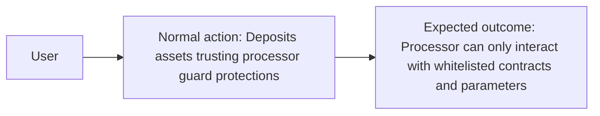

**Attack flow:**
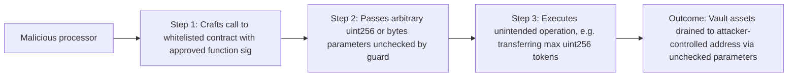

### Technical details
**Locations:**
- [src/module/Guard.sol:9-29](src/module/Guard.sol#L9-L29)

**Description:**
The `Guard.validateCall` function iterates over `rule.paramRules` and only validates parameters of type `ParamType.ADDRESS`:

```solidity
for (uint256 i = 0; i < rule.paramRules.length; i++) {
    if (rule.paramRules[i].paramType == IVault.ParamType.ADDRESS) {
        address addressValue = abi.decode(data[4 + i * 32:], (address));
        _validateAddress(addressValue, rule.paramRules[i]);
        continue;
    }
}
```

There is no validation logic for `ParamType.UINT256` parameters. The loop body contains only an `if` check for ADDRESS type with a `continue` -- any non-ADDRESS parameter is silently skipped without validation. This means that if a processor rule has a `UINT256` parameter with intended constraints (e.g., maximum transfer amount), those constraints are never enforced.

For example, a processor rule for `ERC20.transfer(address,uint256)` might whitelist the recipient address but the amount (a uint256 parameter) has no validation -- the processor can transfer the entire vault balance.

The guard also decodes parameters at fixed 32-byte offsets (`data[4 + i * 32:]`), which works for standard ABI encoding but could be bypassed with non-standard encoding for dynamic types if `isArray` is true.

### Business impact
**Exploitation:**
A processor role holder can bypass amount limits on any whitelisted function call. Even if the `PROCESSOR_MANAGER_ROLE` carefully configures rules to restrict which addresses the processor can interact with, the processor can still pass any amount. This could allow draining vault assets by calling `transfer` or `approve` with `type(uint256).max` as the amount to a whitelisted address that the processor controls or colluded with.

### Verification and testing
**Verify options:**
- Review deployed processor rules to identify any rules with UINT256 paramRules that are intended to enforce amount limits
- Test calling `processor()` with a whitelisted function but an extreme uint256 value
- Verify that all critical processor operations use custom IValidator contracts rather than paramRules

**PoC verification prompt:**
Configure a processor rule for `IERC20.transfer(address,uint256)` with paramRules: [ADDRESS with allowList, UINT256]. Call `processor()` with `transfer(whitelistedAddr, type(uint256).max)`. Confirm the guard does not revert and the full balance is transferred.

### Remediation
**Recommendations:**
- Implement UINT256 validation in the guard with min/max range checks:
```solidity
if (rule.paramRules[i].paramType == IVault.ParamType.UINT256) {
    uint256 value = abi.decode(data[4 + i * 32:], (uint256));
    _validateUint256(value, rule.paramRules[i]);
    continue;
}
```
- Add `uint256 minValue` and `uint256 maxValue` fields to the `ParamRule` struct
- Alternatively, require all processor rules to use custom `IValidator` contracts for functions that handle asset amounts
- Consider adding a global maximum single-transaction value for processor calls

**References:**
- KB: `reference/solidity/fv-sol-4-bad-access-control/`
- KB: `reference/solidity/fv-sol-4-bad-access-control/fv-sol-4-c6-arbitrary-external-call.md`

### Expert attribution

**Discovery status:** Found by Expert 1 only

**Expert oversight analysis:** Expert 2 focused on the economic implications of the processor system but did not drill into the guard's parameter validation logic at the code level. Expert 2 acknowledges this as a valid finding -- the incomplete validation creates a false sense of security for rule configurators.

### Triager note
VALID - The guard system creates an expectation of parameter-level validation that it does not fulfil for non-address types. While exploitation requires the PROCESSOR_ROLE (which is presumably a trusted operator), the guard exists specifically to constrain this role. The finding demonstrates that the guard's constraint on amount parameters is ineffective.

**Bounty assessment:** Valid high-severity finding. The guard's purpose is to restrict processor actions, and it fails to do so for a fundamental parameter type. Even if the processor is semi-trusted, this undermines the guard's entire security model.

---

## H-3 Withdrawal fee bypass on privileged withdrawAsset path

### Core information
**Severity:** High

**Probability:** Medium

**Confidence:** High

### User impact analysis
**Innocent user story:**
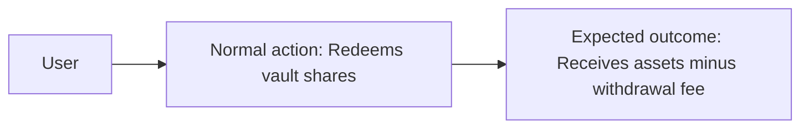

**Attack flow:**
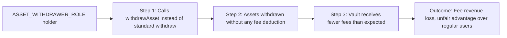

### Technical details
**Locations:**
- [src/BaseVault.sol:613-629](src/BaseVault.sol#L613-L629)
- [src/BaseVault.sol:640-664](src/BaseVault.sol#L640-L664)

**Description:**
The `withdrawAsset` function is a privileged withdrawal path that bypasses the withdrawal fee entirely. Compare the standard `withdraw` and `redeem` paths which apply fees via `previewWithdraw` (which adds `_feeOnRaw`) and `previewRedeem` (which subtracts `_feeOnTotal`):

```solidity
// Standard withdraw -- applies fee
function previewWithdraw(uint256 assets) public view virtual returns (uint256 shares) {
    uint256 fee = _feeOnRaw(assets, _msgSender());
    (shares,) = _convertToShares(asset(), assets + fee, Math.Rounding.Ceil);
}

// withdrawAsset -- no fee
function withdrawAsset(address asset_, uint256 assets, address receiver, address owner)
    public virtual onlyRole(ASSET_WITHDRAWER_ROLE) returns (uint256 shares) {
    (shares,) = _convertToShares(asset_, assets, Math.Rounding.Ceil);
    // ... no fee applied
    _withdrawAsset(asset_, _msgSender(), receiver, owner, assets, shares);
}
```

The `_withdrawAsset` internal function also does not apply any fee. This means that any address with `ASSET_WITHDRAWER_ROLE` can withdraw assets at the full share value without paying the configured withdrawal fee. If this role is granted to users or integrated contracts, they receive preferential treatment that is not transparent to other vault participants.

The fee collected by the vault on regular withdrawals effectively subsidises ASSET_WITHDRAWER_ROLE holders by maintaining a higher share price than would exist if all withdrawals were fee-free.

### Business impact
**Exploitation:**
The vault's withdrawal fee is a core revenue mechanism. If a significant volume of withdrawals occurs through the `withdrawAsset` path, the vault collects less fee revenue than expected. More importantly, if `ASSET_WITHDRAWER_ROLE` is granted to addresses that can also use standard withdrawal paths, they can choose whichever path is more favourable -- always avoiding the fee. This creates a two-tier system where fee-exempt users extract more value per share than regular users, effectively socialising the cost.

### Verification and testing
**Verify options:**
- Check which addresses hold ASSET_WITHDRAWER_ROLE in the deployed contract
- Verify whether the fee-free withdrawal via `withdrawAsset` is intentional and documented
- Compare withdrawal amounts between `withdraw(100, addr, owner)` and `withdrawAsset(asset, 100, addr, owner)`

**PoC verification prompt:**
As ASSET_WITHDRAWER_ROLE, call `withdrawAsset(asset, 1000e18, receiver, owner)`. Compare the shares burned to what `previewWithdraw(1000e18)` would return. The shares burned via `withdrawAsset` will be fewer because no fee is applied, demonstrating the fee bypass.

### Remediation
**Recommendations:**
- If the fee exemption is intentional, document it clearly and restrict ASSET_WITHDRAWER_ROLE to only addresses that require fee-free withdrawals (e.g., strategy rebalancing contracts)
- If unintentional, apply the same fee logic in `withdrawAsset`:
```solidity
uint256 fee = _feeOnRaw(assets, owner);
(shares,) = _convertToShares(asset_, assets + fee, Math.Rounding.Ceil);
```
- Consider adding an explicit `feeExempt` mapping rather than tying fee exemption to the withdrawal mechanism used

**References:**
- KB: `reference/solidity/protocols/yield.md` -- Rounding and Precision Loss, ERC Standard Non-Compliance
- EIP-4626 specification -- consistency of fee application across paths

### Expert attribution

**Discovery status:** Found by both experts

**Expert oversight analysis:** Both experts independently identified that the `withdrawAsset` path does not apply withdrawal fees while the standard paths do. Expert 1 flagged it as a consistency issue; Expert 2 highlighted the economic unfairness to regular depositors.

### Triager note
VALID - The finding is clear: two withdrawal paths with different fee treatment. Whether this is a bug or an intentional design for privileged withdrawers, it should be explicitly documented. The current state creates an implicit privilege that may not be understood by integrators or depositors.

**Bounty assessment:** If intentional, downgrade to Low/Informational. If unintentional, High severity is appropriate as it represents direct fee revenue loss.

---

## M-1 Stale totalAssets cache exploitable for share price arbitrage

### Core information
**Severity:** Medium

**Probability:** Medium

**Confidence:** High

### User impact analysis
**Innocent user story:**
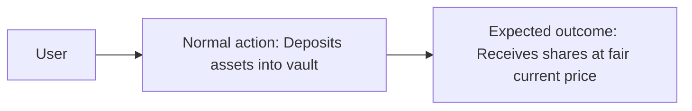

**Attack flow:**
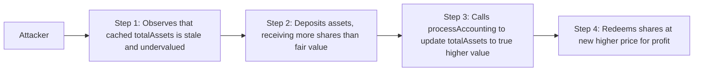

### Technical details
**Locations:**
- [src/BaseVault.sol:118-133](src/BaseVault.sol#L118-L133)
- [src/library/VaultLib.sol:253-275](src/library/VaultLib.sol#L253-L275)
- [src/library/VaultLib.sol:394-432](src/library/VaultLib.sol#L394-L432)

**Description:**
When `alwaysComputeTotalAssets` is false (the default for gas efficiency), the vault uses a cached `totalAssets` value stored in `VaultStorage.totalAssets`. This value is only updated via:
1. `_addTotalAssets` on deposit
2. `_subTotalAssets` on withdrawal
3. `processAccounting()` which recomputes from actual balances

The problem is that external yield accrual (from strategies, interest, or token rebasing) changes the actual total assets without updating the cache. Between `processAccounting` calls, the cached value diverges from reality. If the vault's assets grow through yield, the cached value understates total assets, meaning the share price appears lower than it truly is. Depositors during this window receive more shares than they should.

Conversely, if assets decrease (e.g., strategy losses, slashing), the cached value overstates total assets, and depositors receive fewer shares than fair value.

An attacker can:
1. Wait for significant yield accrual (stale low cache)
2. Deposit a large amount at the artificially low share price
3. Immediately call `processAccounting()` (permissionless) to update the cache
4. Redeem at the now-higher share price

The profit equals the yield accrued since the last `processAccounting` call, proportional to the attacker's deposit size relative to total vault assets.

### Business impact
**Exploitation:**
This is a form of just-in-time (JIT) deposit attack. The attacker captures yield that should belong to existing depositors. The magnitude depends on the frequency of `processAccounting` calls and the rate of yield accrual. For RWA vaults where yield accrues continuously but accounting is processed periodically, this could be significant.

### Verification and testing
**Verify options:**
- Check how frequently `processAccounting` is called on the deployed vault
- Calculate the maximum yield accrual between accounting cycles
- Test deposit-then-processAccounting-then-redeem sequence for profit

**PoC verification prompt:**
Set up a vault with `alwaysComputeTotalAssets = false`. Deposit initial assets and mint shares. Simulate yield accrual by transferring tokens to the vault's buffer strategy. Deposit as attacker before calling `processAccounting()`. Call `processAccounting()`. Redeem attacker's shares. Verify attacker received more assets than deposited.

### Remediation
**Recommendations:**
- Call `processAccounting()` at the start of every deposit and withdrawal, or enable `alwaysComputeTotalAssets` for high-value vaults
- Add a minimum deposit lock period to prevent same-block deposit-redeem arbitrage
- Implement a `beforeDeposit` hook that automatically triggers accounting refresh
- Consider implementing an ERC4626-style virtual offset or TWAP-based share pricing

**References:**
- KB: `reference/solidity/protocols/yield.md` -- Stale Cached State Desynchronisation
- KB: `reference/solidity/fv-sol-5-logic-errors/fv-sol-5-c6-same-block-snapshot-abuse.md`

### Expert attribution

**Discovery status:** Found by both experts

**Expert oversight analysis:** Both experts independently identified the stale cache risk. Expert 1 focused on the technical mechanism; Expert 2 modelled the economic arbitrage opportunity.

### Triager note
VALID - The stale cache is a fundamental design trade-off documented in the code comments. However, the permissionless `processAccounting()` combined with permissionless deposits creates a clear arbitrage path. The severity depends on the actual yield rate and accounting frequency.

**Bounty assessment:** Medium severity is appropriate. The attack is economically rational but requires timing and capital. The protocol acknowledges the caching trade-off, but the arbitrage vector is not explicitly mitigated.

---

## M-2 processAccounting is permissionless and manipulable via donation

### Core information
**Severity:** Medium

**Probability:** Medium

**Confidence:** Medium

### User impact analysis
**Innocent user story:**
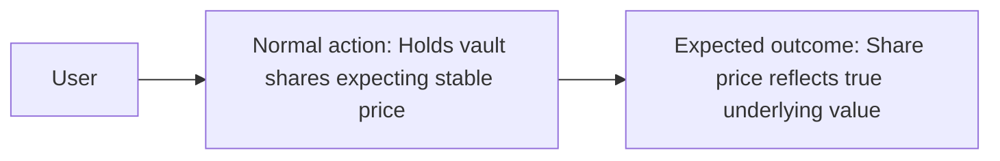

**Attack flow:**
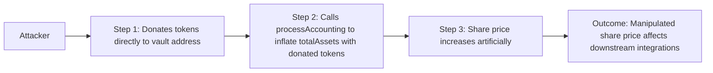

### Technical details
**Locations:**
- [src/BaseVault.sol:933-939](src/BaseVault.sol#L933-L939)
- [src/library/VaultLib.sol:374-432](src/library/VaultLib.sol#L374-L432)

**Description:**
The `processAccounting()` function is callable by anyone (no access control) and computes total assets by summing `balanceOf(address(this))` for all vault-listed assets:

```solidity
function computeTotalAssets() public view returns (uint256 totalBaseBalance) {
    totalBaseBalance = vaultStorage.countNativeAsset ? address(this).balance : 0;
    for (uint256 i = 0; i < assetListLength; i++) {
        uint256 balance = IERC20(assetList[i]).balanceOf(address(this));
        if (balance == 0) continue;
        totalBaseBalance += convertAssetToBase(assetList[i], balance, Math.Rounding.Floor);
    }
}
```

This relies on raw `balanceOf` which includes directly donated tokens. An attacker can:
1. Transfer tokens directly to the vault (not via `deposit`)
2. Call `processAccounting()` to update totalAssets to include the donation
3. The share price inflates because totalAssets increased without totalSupply increasing

While this alone does not directly extract funds, it can be combined with other vectors:
- Inflate share price before a large withdrawal to extract more assets
- Manipulate oracle-dependent calculations that reference the vault's share price
- In the case of `countNativeAsset = true`, ETH can be force-sent via `selfdestruct` or coinbase rewards

The `receive()` function accepts arbitrary ETH without any accounting, compounding this issue when `countNativeAsset` is true.

### Business impact
**Exploitation:**
The combination of permissionless `processAccounting()` and balance-based total asset computation means any market participant can influence the vault's share price. For RWA vaults used as collateral in lending protocols, this could be exploited to manipulate health factors. The economic cost is the donated tokens themselves, which remain in the vault and benefit existing shareholders.

### Verification and testing
**Verify options:**
- Transfer tokens directly to the vault address and call `processAccounting()`
- Observe the change in share price before and after
- Test with `countNativeAsset = true` and force-sending ETH

**PoC verification prompt:**
Deploy the vault with one asset. Make a small initial deposit. Transfer a large amount of the base asset directly to the vault (not via `deposit`). Call `processAccounting()`. Verify that `totalAssets()` now includes the donated amount and `convertToAssets(1e18)` returns more than before.

### Remediation
**Recommendations:**
- Track deposited assets separately from raw balance using internal accounting
- Consider making `processAccounting()` permissioned (e.g., PROCESSOR_ROLE or a dedicated ACCOUNTANT_ROLE)
- Implement donation protection by comparing computed total against the expected total (cached + deposits - withdrawals) and capping the delta
- For native ETH, only count ETH deposited through controlled paths, not raw balance

**References:**
- KB: `reference/solidity/protocols/yield.md` -- First Depositor Share Inflation Attack
- KB: `reference/solidity/fv-sol-5-logic-errors/fv-sol-5-c8-force-eth-injection.md`

### Expert attribution

**Discovery status:** Found by Expert 2 only

**Expert oversight analysis:** Expert 1 focused on the stale cache issue (M-1) but did not consider the inverse problem of donation-based inflation. Expert 1 acknowledges this as a complementary finding to M-1 -- the stale cache can be both too low (yield accrual) and too high (post-donation accounting).

### Triager note
VALID - The donation vector is real but economically costly to the attacker (donated tokens remain in the vault). The primary concern is share price manipulation affecting downstream integrations rather than direct fund theft. Medium severity is appropriate.

**Bounty assessment:** Valid finding but limited direct economic impact. The attacker loses the donated tokens. The risk is primarily for protocols that integrate this vault's share price as a pricing oracle.

---

## M-3 Public fee functions expose internal accounting to external manipulation

### Core information
**Severity:** Medium

**Probability:** Low

**Confidence:** Medium

### User impact analysis
**Innocent user story:**
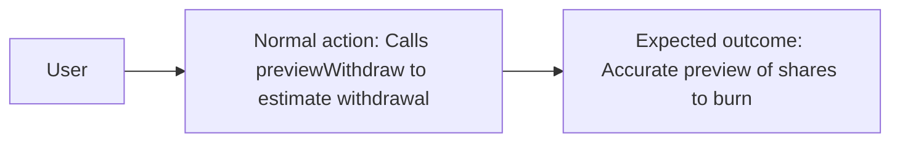

**Attack flow:**
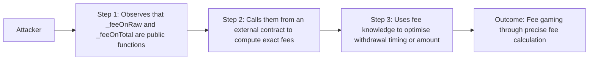

### Technical details
**Locations:**
- [src/BaseVault.sol:1021-1029](src/BaseVault.sol#L1021-L1029)
- [src/Vault.sol:68-82](src/Vault.sol#L68-L82)

**Description:**
The `_feeOnRaw` and `_feeOnTotal` functions are declared as `public view` despite using the underscore-prefix naming convention that traditionally indicates internal/private visibility:

```solidity
function _feeOnRaw(uint256 amount, address user) public view virtual override returns (uint256);
function _feeOnTotal(uint256 amount, address user) public view virtual override returns (uint256);
```

These functions are also declared in the `IVault` interface, making them part of the public API. While the fee logic itself is straightforward (linear percentage), exposing these as public functions means:
1. Any external contract can compute exact fees for any user
2. The underscore prefix creates a false assumption of internal visibility for auditors and developers
3. Composing contracts might call these directly instead of using `previewWithdraw`/`previewRedeem`, potentially creating inconsistencies

This is more of a code quality and convention issue than a direct vulnerability, but the naming inconsistency could lead to integration errors.

### Business impact
**Exploitation:**
Limited direct exploitation potential. The primary risk is that integrators misunderstand the access level of these functions due to the naming convention. A secondary risk is that exposing per-user fee calculations could enable MEV strategies that time withdrawals to specific fee states (e.g., just after a fee override is set).

### Verification and testing
**Verify options:**
- Confirm that `_feeOnRaw` and `_feeOnTotal` are callable from external contracts
- Check for any integrating contracts that rely on these functions' visibility

**PoC verification prompt:**
Call `vault._feeOnRaw(1e18, userAddress)` from an external contract. Verify it returns the fee amount without reverting. Compare with calling via the IVault interface.

### Remediation
**Recommendations:**
- Rename to `feeOnRaw` and `feeOnTotal` (removing underscore prefix) to match their actual visibility
- Or change visibility to `internal` if external access is not required and update the interface accordingly
- Add explicit documentation that these are intentionally public for integration purposes

**References:**
- Solidity style guide: underscore prefix for private/internal functions
- KB: `reference/solidity/fv-sol-5-logic-errors/`

### Expert attribution

**Discovery status:** Found by Expert 2 only

**Expert oversight analysis:** Expert 1 did not flag this as it is more of a code quality issue. Expert 1 agrees the naming is inconsistent but considers the security impact minimal given that fee rates are already visible on-chain.

### Triager note
QUESTIONABLE - This is primarily a code quality issue. The fee calculation logic is deterministic and based on on-chain state, so exposing it publicly does not create new information asymmetry. The naming convention violation is a legitimate concern but not a security vulnerability per se.

**Bounty assessment:** Low bounty recommended ($100-$200) as a best-practice improvement. The naming inconsistency is a real issue that could cause integration confusion.

---

## M-4 Provider oracle single point of failure with no staleness check

### Core information
**Severity:** Medium

**Probability:** Low

**Confidence:** High

### User impact analysis
**Innocent user story:**
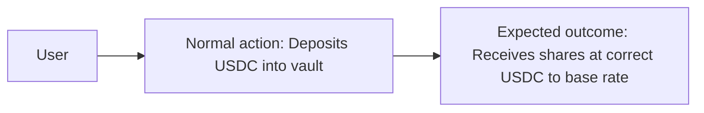

**Attack flow:**
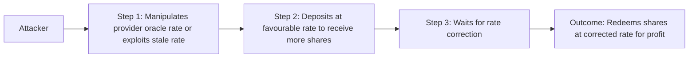

### Technical details
**Locations:**
- [src/library/VaultLib.sol:221-229](src/library/VaultLib.sol#L221-L229)
- [src/library/VaultLib.sol:239-247](src/library/VaultLib.sol#L239-L247)

**Description:**
All asset-to-base and base-to-asset conversions depend on `IProvider(provider).getRate(asset)`:

```solidity
function convertAssetToBase(address asset_, uint256 assets, Math.Rounding rounding)
    public view returns (uint256 baseAssets) {
    uint256 rate = IProvider(getVaultStorage().provider).getRate(asset_);
    baseAssets = assets.mulDiv(rate, 10 ** (getAssetStorage().assets[asset_].decimals), rounding);
}
```

The provider is a single external contract with no on-chain validation of:
- Rate staleness (no timestamp check, no heartbeat validation)
- Rate bounds (no minimum/maximum rate sanity check)
- Provider liveness (no fallback mechanism)
- Rate manipulation resistance (no TWAP or multi-oracle aggregation)

If the provider returns a zero rate, `convertBaseToAsset` would divide by zero (caught by Math.mulDiv as a revert, but this causes DoS). If the provider returns an inflated rate, deposits would receive fewer shares than deserved. If it returns a deflated rate, deposits would receive more shares, enabling arbitrage.

The provider is set by `PROVIDER_MANAGER_ROLE` and has no timelock on updates. A compromised provider manager could set a malicious provider that returns manipulated rates.

### Business impact
**Exploitation:**
For an RWA vault, rate accuracy is critical because RWA asset prices do not update on-chain as frequently as DeFi tokens. A stale or manipulated rate could cause significant mispricing of deposits and withdrawals. The single-provider architecture means a single point of failure -- if the provider is compromised, paused, or returns incorrect data, the entire vault's accounting is affected.

### Verification and testing
**Verify options:**
- Review the deployed provider contract implementation
- Check if the provider includes staleness checks internally
- Test vault behaviour when provider returns extreme values (0, type(uint256).max)
- Verify whether the provider is behind a proxy and who controls upgrades

**PoC verification prompt:**
Deploy a mock provider that returns `rate = 2 * actualRate` for the base asset. Set it as the vault's provider. Deposit assets and verify that shares received are approximately half of what they should be. Reset provider to correct rate and redeem shares for approximately double the deposit amount.

### Remediation
**Recommendations:**
- Add rate sanity bounds checking in `convertAssetToBase` and `convertBaseToAsset`:
```solidity
require(rate > 0, "Zero rate");
require(rate >= minRate && rate <= maxRate, "Rate out of bounds");
```
- Implement a rate deviation circuit breaker that pauses deposits/withdrawals if the rate changes by more than a threshold between calls
- Add a fallback provider mechanism
- Consider adding a timelock to `setProvider` to prevent instant oracle manipulation
- Document the provider's update frequency and staleness guarantees

**References:**
- KB: `reference/solidity/fv-sol-10-oracle-manipulation/`
- KB: `reference/solidity/protocols/yield.md` -- Stale Cached State Desynchronisation

### Expert attribution

**Discovery status:** Found by both experts

**Expert oversight analysis:** Both experts identified the oracle dependency risk. Expert 1 focused on the technical absence of validation; Expert 2 focused on the economic manipulation potential for RWA assets with infrequent price updates.

### Triager note
VALID - The provider is a critical dependency with no on-chain validation. However, the actual risk depends entirely on the provider implementation (which is out of scope). If the provider implements its own staleness and sanity checks internally, this finding reduces to informational. Medium severity is appropriate given the uncertainty.

**Bounty assessment:** Valid architectural concern. The vault should not blindly trust external rate data regardless of the provider's internal implementation. Defence in depth requires validation at the consumer level.

---

## L-1 First depositor inflation attack partially mitigated but not eliminated

### Core information
**Severity:** Low

**Probability:** Low

**Confidence:** High

### User impact analysis
**Innocent user story:**
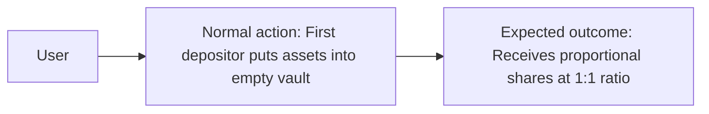

**Attack flow:**
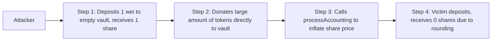

### Technical details
**Locations:**
- [src/library/VaultLib.sol:285-313](src/library/VaultLib.sol#L285-L313)

**Description:**
The vault uses a `+1` virtual offset in its share conversion formulae:

```solidity
baseAssets = shares.mulDiv(totalAssets + 1, totalSupply + 1, rounding);
shares = baseAssets.mulDiv(totalSupply + 1, totalAssets + 1, rounding);
```

This is the minimal virtual offset pattern (adding 1 virtual share and 1 virtual asset). While this provides some protection against the first-depositor inflation attack, the protection is minimal. The OpenZeppelin recommendation is to use `_decimalsOffset()` returning 3-8, which adds `10^3` to `10^8` virtual shares, making the attack require impractically large donations.

With only `+1` offset, the attack cost is reduced but not eliminated. An attacker depositing 1 wei and donating `D` tokens inflates the share price to approximately `D`. A victim depositing `V` assets where `V < D` would receive 0 shares. With the `+1` offset, the attacker would need `D > V` for the attack to round the victim's shares to 0, which is the same as without offset for large enough `D`.

However, the vault's `_deposit` function does not check for `shares == 0`, meaning a deposit that rounds to 0 shares would succeed silently, minting 0 shares while still transferring assets.

### Business impact
**Exploitation:**
The practical risk is low because: (1) the vault initialises in a paused state, allowing the admin to seed it before public deposits; (2) the `+1` offset makes the attack more expensive; (3) the `processAccounting` step is required if `alwaysComputeTotalAssets` is false. However, the residual risk exists for any deployment where the vault is unpaused without adequate seeding.

### Verification and testing
**Verify options:**
- Check whether the deployed vault was seeded with initial deposits before unpausing
- Test depositing 1 wei to an empty vault, donating a large amount, then depositing as a victim

**PoC verification prompt:**
Deploy an empty vault with `alwaysComputeTotalAssets = true`. Deposit 1 wei as attacker. Transfer 10e18 tokens directly to vault. Deposit 5e18 as victim. Check if victim receives 0 shares.

### Remediation
**Recommendations:**
- Increase the virtual offset to at least `10^3` (preferably `10^6`):
```solidity
uint256 VIRTUAL_OFFSET = 1e6;
baseAssets = shares.mulDiv(totalAssets + VIRTUAL_OFFSET, totalSupply + VIRTUAL_OFFSET, rounding);
```
- Add a `require(shares > 0, "Zero shares")` check in `_deposit`
- Document the requirement that the vault must be seeded with a minimum deposit before unpausing
- Consider minting dead shares to `address(0xdead)` on first deposit

**References:**
- KB: `reference/solidity/protocols/yield.md` -- First Depositor Share Inflation Attack
- KB: `reference/solidity/fv-sol-2-precision-errors/fv-sol-2-c6-erc4626-rounding.md`

### Expert attribution

**Discovery status:** Found by both experts

**Expert oversight analysis:** Both experts identified the minimal virtual offset. Expert 1 noted the mathematical insufficiency; Expert 2 noted the operational mitigation (paused initialisation). Consensus: low severity due to operational mitigations but worth documenting.

### Triager note
VALID - The `+1` offset is the minimum possible mitigation and is weaker than industry best practice. The paused initialisation provides operational protection but is not enforced at the contract level (nothing prevents unpausing an unseeded vault). Low severity is appropriate.

**Bounty assessment:** Low bounty ($150-$300). The issue is well-documented in the ERC4626 community, the vault has partial mitigation, and exploitation requires a specific deployment sequence.

---

## L-2 Receive function accepts native ETH without share accounting

### Core information
**Severity:** Low

**Probability:** Low

**Confidence:** High

### Technical details
**Locations:**
- [src/BaseVault.sol:1010-1012](src/BaseVault.sol#L1010-L1012)

**Description:**
The vault has a `receive()` function that accepts arbitrary ETH transfers:

```solidity
receive() external payable {
    emit NativeDeposit(msg.value);
}
```

This ETH is not accounted for in terms of shares -- no shares are minted to the sender. When `countNativeAsset` is true, this ETH is included in `computeTotalAssets()` via `address(this).balance`, inflating the total assets and thereby the share price for existing holders.

This creates an asymmetry: ETH can be sent to the vault (inflating share price) but there is no corresponding mechanism to withdraw ETH through the standard ERC4626 paths (which only handle ERC20 tokens via the buffer strategy). The processor can move ETH out via arbitrary calls, but regular users cannot.

Additionally, ETH can be force-sent to the contract via `selfdestruct` (deprecated but still functional), coinbase rewards, or pre-funded CREATE2 addresses, bypassing the `receive()` function entirely.

### Business impact
**Exploitation:**
Limited direct exploitation. The primary concern is that donated ETH permanently inflates the share price when `countNativeAsset = true`. This could be used to manipulate the vault's reported NAV. The economic cost to the attacker is the donated ETH itself.

### Remediation
**Recommendations:**
- If ETH deposits are intended, implement proper share minting for ETH deposits
- If ETH deposits are not intended and `countNativeAsset` is false, consider reverting in `receive()`
- Track internal ETH accounting separately from raw balance to prevent donation manipulation

**References:**
- KB: `reference/solidity/fv-sol-5-logic-errors/fv-sol-5-c8-force-eth-injection.md`

### Expert attribution

**Discovery status:** Found by Expert 1 only

**Expert oversight analysis:** Expert 2 did not consider ETH-specific attack vectors due to focusing on ERC20 asset flows. Acknowledged as valid after review.

### Triager note
VALID - Minor issue. The `receive()` function is necessary if the vault needs to receive ETH from strategy operations. The lack of share minting is by design (ETH is managed by the processor, not individual depositors). Low severity is appropriate.

**Bounty assessment:** $50-$100. This is a known pattern in multi-asset vaults. The documentation should clarify the intended ETH handling model.

---

## L-3 Guard parameter validation only checks ADDRESS type, skipping UINT256

### Core information
**Severity:** Low

**Probability:** Low

**Confidence:** High

### Technical details
**Locations:**
- [src/module/Guard.sol:22-29](src/module/Guard.sol#L22-L29)

**Description:**
This is the lower-severity companion to H-2. The guard loop explicitly handles `ParamType.ADDRESS` but silently skips `ParamType.UINT256`:

```solidity
for (uint256 i = 0; i < rule.paramRules.length; i++) {
    if (rule.paramRules[i].paramType == IVault.ParamType.ADDRESS) {
        address addressValue = abi.decode(data[4 + i * 32:], (address));
        _validateAddress(addressValue, rule.paramRules[i]);
        continue;
    }
    // UINT256 silently skipped -- no validation
}
```

If the `ParamType` enum is extended in the future with additional types (e.g., `BYTES32`, `BOOL`), those would also be silently skipped. The loop should either revert on unhandled types or provide explicit no-op handling.

### Remediation
**Recommendations:**
- Add a `revert` for unhandled parameter types as a safety measure:
```solidity
else {
    revert UnsupportedParamType(rule.paramRules[i].paramType);
}
```
- Or implement UINT256 validation with min/max range checking

**References:**
- KB: `reference/solidity/fv-sol-5-logic-errors/`

### Expert attribution

**Discovery status:** Found by Expert 1 only

### Triager note
VALID - Code quality issue. The silent skip creates a false sense of security. Low severity because exploitation requires PROCESSOR_ROLE, which is already a trusted role.

**Bounty assessment:** $50-$100.

---

## L-4 deleteAsset uses swap-and-pop which may break external index assumptions

### Core information
**Severity:** Low

**Probability:** Low

**Confidence:** Medium

### Technical details
**Locations:**
- [src/library/VaultLib.sol:184-211](src/library/VaultLib.sol#L184-L211)

**Description:**
The `deleteAsset` function uses the swap-and-pop pattern to remove assets from the list:

```solidity
assetStorage.list[index] = assetStorage.list[assetStorage.list.length - 1];
assetStorage.list.pop();
delete assetStorage.assets[asset_];

if (index < assetStorage.list.length) {
    address movedAsset = assetStorage.list[index];
    assetStorage.assets[movedAsset].index = index;
}
```

While the internal index is updated for the moved asset, any external system or contract that cached the asset's index before deletion would now reference a different asset. The base asset (index 0) and default asset (index 0 or 1) are protected from deletion, but other assets can shift positions.

The contract emits `DeleteAsset(index, asset_)` but does not emit an event for the moved asset's index change, making it harder for off-chain systems to track the index reassignment.

### Remediation
**Recommendations:**
- Emit an event when an asset is moved to a new index:
```solidity
if (index < assetStorage.list.length) {
    address movedAsset = assetStorage.list[index];
    assetStorage.assets[movedAsset].index = index;
    emit AssetMoved(movedAsset, assetStorage.list.length, index);
}
```
- Document that asset indices are unstable after deletions

**References:**
- KB: `reference/solidity/fv-sol-5-logic-errors/fv-sol-5-c10-data-structure-state-integrity.md`

### Expert attribution

**Discovery status:** Found by Expert 2 only

### Triager note
QUESTIONABLE - The swap-and-pop pattern is standard and the internal state is correctly updated. The risk is limited to off-chain systems that cache indices. Low severity is appropriate if no on-chain consumers depend on stable indices.

**Bounty assessment:** $50-$100. Best-practice improvement for event completeness.

---

## Additional observations (informational)

### ERC4626 rounding directions are correctly implemented
The vault correctly applies:
- `Math.Rounding.Floor` for `previewDeposit` and `convertToShares` (fewer shares for depositor)
- `Math.Rounding.Ceil` for `previewMint` and `previewWithdraw` (more assets/shares against user)
- `Math.Rounding.Floor` for `previewRedeem` and `convertToAssets` (fewer assets for redeemer)

This follows the ERC4626 specification correctly.

### Reentrancy protection is present
All user-facing entry points (`deposit`, `mint`, `withdraw`, `redeem`, `depositAsset`, `processAccounting`) use the `nonReentrant` modifier from OpenZeppelin's `ReentrancyGuardUpgradeable`. The `withdrawAsset` function uses `onlyRole` which provides implicit access control but lacks `nonReentrant` -- however, since it requires `ASSET_WITHDRAWER_ROLE`, the reentrancy risk is limited to trusted addresses.

### Role-based access control is granular
The vault implements 9 distinct roles (DEFAULT_ADMIN_ROLE, PROCESSOR_ROLE, PAUSER_ROLE, UNPAUSER_ROLE, PROVIDER_MANAGER_ROLE, BUFFER_MANAGER_ROLE, ASSET_MANAGER_ROLE, PROCESSOR_MANAGER_ROLE, HOOKS_MANAGER_ROLE, ASSET_WITHDRAWER_ROLE, FEE_MANAGER_ROLE), providing good separation of concerns. The security model depends heavily on proper role assignment.

### SafeERC20 is used consistently
All token transfers use OpenZeppelin's `SafeERC20` library (`safeTransferFrom`, `safeTransfer`), protecting against non-standard ERC20 tokens that do not return a boolean.

### Constructor disables initialisers
The `constructor() { _disableInitializers(); }` pattern correctly prevents the implementation contract from being initialised directly, following the standard UUPS/transparent proxy security practice.

### Fee-on-transfer tokens
The vault does not measure `balanceBefore`/`balanceAfter` for deposits, meaning fee-on-transfer tokens would cause accounting discrepancies. The depositor would receive shares based on the specified `assets` amount, but the vault would receive fewer actual tokens. This is an inherent limitation that should be documented in the asset onboarding process -- fee-on-transfer tokens should not be added to the asset list.
