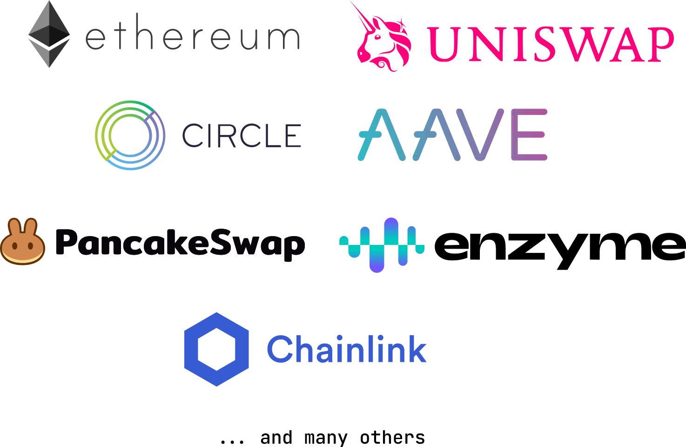

[](https://badge.fury.io/py/web3-ethereum-defi)

[](https://github.com/tradingstrategy-ai/web3-ethereum-defi/actions/workflows/test.yml)

[](https://web3-ethereum-defi.readthedocs.io/)

# Web3-Ethereum-Defi

Web-Ethereum-DeFi Python package provides high level modules for smart
contracts, with prepackaged ABI files for DeFi protocol integration,
wallet management, JSON-RPC providers and automated test suites. The
package aims for robustness, high quality of the code and documentation.

* [Use cases](#use-cases)
* [Prerequisites](#prerequisites)
* [Install](#install)
* [Code examples](#code-examples)
   * [Deploy and transfer ERC-20 token between wallets](#deploy-and-transfer-erc-20-token-between-wallets)
   * [Uniswap v2 trade example](#uniswap-v2-trade-example)
   * [Uniswap v2 price estimation example](#uniswap-v2-price-estimation-example)
* [How to use the library in your Python project](#how-to-use-the-library-in-your-python-project)
* [Documentation](#documentation)
  * [Development and contributing](#development-and-contributing)
* [Version history](#version-history)
* [Support](#support)
* [Social media](#social-media)
* [History](#history)
* [License](#license)



-   Supported [blockchains](https://tradingstrategy.ai/glossary) include
    Ethereum, BNB Chain, Polygon, Avalanche C-chain, Arbitrum and many
    other [EVM-compatible
    blockchains](https://tradingstrategy.ai/glossary/evm-compatible).
-   Supported
    [DeFi](https://tradingstrategy.ai/glossary/decentralised-finance)
    [protocols](https://tradingstrategy.ai/glossary/protocol) include
    [Uniswap](https://tradingstrategy.ai/glossary/uniswap) with its
    [clones](https://tradingstrategy.ai/glossary/fork),
    [Aave](https://tradingstrategy.ai/glossary/aave),
    [USDC](https://tradingstrategy.ai/glossary/usdc), other Circle
    [stablecoin tokens](https://tradingstrategy.ai/glossary/stablecoin),
    [Enzyme](https://tradingstrategy.ai/glossary/enzyme-protocol),
    Chainlink and many others.

# Use cases

Use cases for this package include

-   Trading and bots
-   Data research, extraction, transformation and loading
-   Portfolio management and accounting
-   System integrations and backends
 
# Features

Features include e.g.

* [High-quality API documentation](https://web3-ethereum-defi.readthedocs.io/)
* [Fully type hinted](https://web3-ethereum-defi.readthedocs.io/) for good developer experience
* [MEV protection](https://web3-ethereum-defi.readthedocs.io/api/provider/_autosummary_provider/eth_defi.provider.mev_blocker.html#module-eth_defi.provider.mev_blocker)
* [Mainnet forking with Anvil](https://web3-ethereum-defi.readthedocs.io/api/_autosummary/eth_defi.anvil.html#module-eth_defi.anvil)
* [Revert reasons and stack traces for Solidity errors](https://web3-ethereum-defi.readthedocs.io/api/_autosummary/eth_defi.trace.html)
* [Swap, slippage and price impact estimation](https://web3-ethereum-defi.readthedocs.io/api/index.html)
* [ERC-20 token issuance and transfers](https://web3-ethereum-defi.readthedocs.io/en/latest/_autosummary/eth_defi.token.html#module-eth_defi.token)
* [EIP-712, EIP-3009 support](https://web3-ethereum-defi.readthedocs.io/api/core/_autosummary/eth_defi.eip_712.html#module-eth_defi.eip_712)

Web3-Ethereum-Defi supports 

* Uniswap (both v2 and v3)
* Sushi
* Aave 
* Enzyme Protocol
* dHEDGE Protocol
* More integrations to come
* Built-in integration for over 600 smart contracts with precompiled Solidity ABI files 

[Read the full API documentation](https://web3-ethereum-defi.readthedocs.io/)).
For code examples please see below.

# Prerequisites

To use this package you need to

* Have Python 3.10, Python 3.11, or Python 3.12 (no other versions tested)
* macOS, Linux or Windows Subsystem for Linux (WSL) needed, Microsoft Windows is not officially supported
* [Be proficient in Python programming](https://wiki.python.org/moin/BeginnersGuide)
* [Understand of Web3.py library](https://web3py.readthedocs.io/en/stable/) 
* [Understand Pytest basics](https://docs.pytest.org/)

# Install

With `pip`:

```shell
pip install "web3-ethereum-defi[data]"
```

With `poetry`:

```shell
# Poetry version
poetry add -E data web3-ethereum-defi
```

With `poetry` - master Git branch: 

```shell
git clone git@github.com:tradingstrategy-ai/web3-ethereum-defi.git
cd web3-ethereum-defi
poetry shell
poetry install --all-extras
```

# Example code

See [the tutorials section in the documentation](https://web3-ethereum-defi.readthedocs.io/tutorials/index.html)
for full code examples.

## PancakeSwap swap example

- This example shows how to read the live trades of PancakeSwap,
  and other [Uniswap v2 compatible forks](https://tradingstrategy.ai/glossary/fork) on BNB Smart Chain

- [See the instructions and full example source code in Tutorials](https://web3-ethereum-defi.readthedocs.io/tutorials/pancakeswap-live-minimal.html)

```python
import os
import time
from functools import lru_cache

from web3 import HTTPProvider, Web3

from eth_defi.abi import get_contract
from eth_defi.chain import install_chain_middleware
from eth_defi.event_reader.filter import Filter
from eth_defi.event_reader.logresult import decode_log
from eth_defi.event_reader.reader import read_events, LogResult
from eth_defi.uniswap_v2.pair import fetch_pair_details, PairDetails


QUOTE_TOKENS = ["BUSD", "USDC", "USDT"]


@lru_cache(maxsize=100)
def fetch_pair_details_cached(web3: Web3, pair_address: str) -> PairDetails:
    return fetch_pair_details(web3, pair_address)


def main():
    json_rpc_url = os.environ.get("JSON_RPC_BINANCE", "https://bsc-dataseed.binance.org/")
    web3 = Web3(HTTPProvider(json_rpc_url))
    web3.middleware_onion.clear()
    install_chain_middleware(web3)

    # Read the prepackaged ABI files and set up event filter
    # for any Uniswap v2 like pool on BNB Smart Chain (not just PancakeSwap).
    #
    # We use ABI files distributed by SushiSwap project.
    #
    Pair = get_contract(web3, "sushi/UniswapV2Pair.json")

    filter = Filter.create_filter(address=None, event_types=[Pair.events.Swap])

    latest_block = web3.eth.block_number

    # Keep reading events as they land
    while True:

        start = latest_block
        end = web3.eth.block_number

        evt: LogResult
        for evt in read_events(
            web3,
            start_block=start,
            end_block=end,
            filter=filter,
        ):

            decoded = decode_log(evt)

            # Swap() events are generated by UniswapV2Pool contracts
            pair = fetch_pair_details_cached(web3, decoded["address"])
            token0 = pair.token0
            token1 = pair.token1
            block_number = evt["blockNumber"]

            # Determine the human-readable order of token tickers
            if token0.symbol in QUOTE_TOKENS:
                base = token1  # token
                quote = token0  # stablecoin/BNB
                base_amount = decoded["args"]["amount1Out"] - decoded["args"]["amount1In"]
                quote_amount = decoded["args"]["amount0Out"] - decoded["args"]["amount0In"]
            else:
                base = token0  # stablecoin/BNB
                quote = token1  # token
                base_amount = decoded["args"]["amount0Out"] - decoded["args"]["amount0Out"]
                quote_amount = decoded["args"]["amount1Out"] - decoded["args"]["amount1Out"]

            # Calculate the price in Python Decimal class
            if base_amount and quote_amount:
                human_base_amount = base.convert_to_decimals(base_amount)
                human_quote_amount = quote.convert_to_decimals(quote_amount)
                price = human_quote_amount / human_base_amount

                if human_quote_amount > 0:
                    # We define selling when the stablecoin amount increases
                    # in the swap
                    direction = "sell"
                else:
                    direction = "buy"

                price = abs(price)

                print(f"Swap block:{block_number:,} tx:{evt['transactionHash']} {direction} price:{price:,.8f} {base.symbol}/{quote.symbol}")
            else:
                # Swap() event from DEX that is not Uniswap v2 compatible
                # print(f"Swap block:{block_number:,} tx:{evt['transactionHash']} could not decode")
                pass

        else:
            # No event detected between these blocks
            print(".")

        latest_block = end
        time.sleep(1)


if __name__ == "__main__":
    main()
```

# How to use the library in your Python project

Add `web3-ethereum-defi` as a development dependency:

Using [Poetry](https://python-poetry.org/):

```shell
# Data optional dependencies include pandas and gql, needed to fetch Uniswap v3 data
poetry add -D "web3-ethereum-defi[data]"
```

# Documentation

- [Browse API documentation](https://web3-ethereum-defi.readthedocs.io/).
- [Browse tutorials](https://web3-ethereum-defi.readthedocs.io/tutorials/index.html).

# Development and contributing

- [Read development instructions](https://web3-ethereum-defi.readthedocs.io/development.html).

# Version history

- [Read changelog](https://github.com/tradingstrategy-ai/web3-ethereum-defi/blob/master/CHANGELOG.md).
- [See releases](https://pypi.org/project/web3-ethereum-defi/#history).

# Support 

- [Join Discord for any questions](https://tradingstrategy.ai/community).

# Social media

- [Watch tutorials on YouTube](https://www.youtube.com/@tradingstrategyprotocol)
- [Follow on Twitter](https://twitter.com/TradingProtocol)
- [Follow on Telegram](https://t.me/trading_protocol)
- [Follow on LinkedIn](https://www.linkedin.com/company/trading-strategy/)

# License 

MIT.

[Created by Trading Strategy](https://tradingstrategy.ai).
