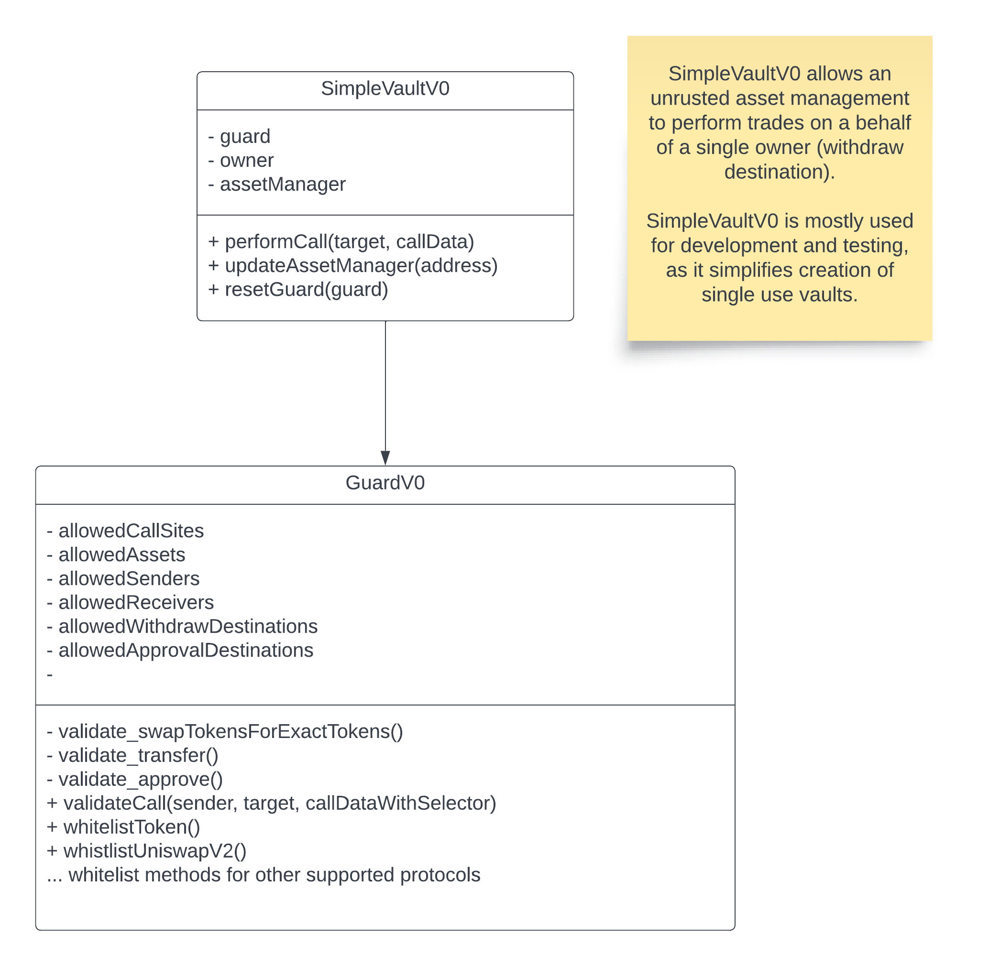
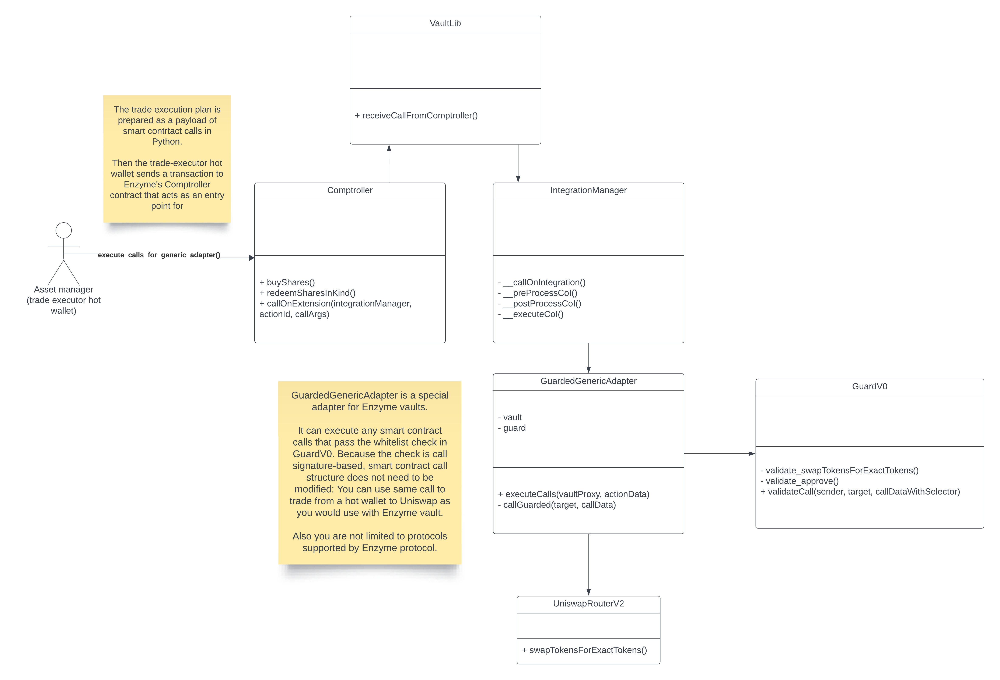

# Guard and vault (prototype)

This is a simple implementation of a guard smart contract and a vault smart contract

- [GuardV0](./src/GuardV0.sol) can check whether an asset manager is allowed to do an action on behalf of the asset owners 
- [SimpleVaultV0](./src/SimpleVaultV0.sol) is an example vault implementation with two roles
  - Owner (who can withdraw assets)
  - Asset manager (who can decide on trades)

This code is prototype code for Trading Strategy Protocol Minimal Viable Product version
and not indented for wider distribution.

## Architecture



## Guard 

Guard will check for activities asset manager perform, all of them which need to be whitelisted by the owner:
- [GuardV0.sol](./src/SimpleVaultV0.sol)
- Any smart contract call (contract address, selector)
- Whitelisted token (asset manager cannot trade into an unsupported token)
- Withdrawal (transfer) of assets - assets can be only withdraw back to the owner
- Uniswap v2 router swaps (approval + swap path)
- Uniswap v3 router (TODO)
- 1delta (skipped - old version no longer supported)

Guard can be used independently from the vault implementation.
It can be used with any asset management protocol e.g.
- SimpleVaultV0 
- Enzyme Protocol's IntegrationManager 

Examples of protected activities that asset manager must be whitelisted to do:

- Every smart contract call must be whitelisted: `validateCall`
- Sending and receiving whitelisted tokens 
- approve() to whitelisted addresses: `validate_approve`
- transfer() to whitelisted addresses: `validate_transfer`
- Check inside Uniswap v2 trades (path contains only whitelisted tokens): `validate_swapTokensForExactTokens`
- .... TODO other checks here

`GuardV0` does not offer any slippage protection, and this is assumed to be encoded
within the trades e.g. in swapTokensForExactTokens arguments.

### Supported guard integrations

- Uniswap v2 compatibles
- Uniswap v3 compatibles
- Aave v3 compatibles (coming)
- 1delta (skipped - old version no longer supported)

## Simple vault

Simple vault can be used as a layer of protection for cases where the hot wallet private key
of the asset manager is compromised: asset manager can only perform legit trades, not withdraw any assets.

- [SimpleVaultV0.sol](./src/SimpleVaultV0.sol)
- The vault has a guard (smart contract), an asset manager (trade executor) and an owner (governance/multisig)
- Initially the vault is configured to allow withdrawals to the owner
- Enabling asset manager allows perform trades
- Each token needs to be separately whitelisted
- Each router needs to be separately whitelisted
- See `test_guard_simple_vault_uniswap_v2` for examples

Simple vault is simple: there is no special logic for deposits or redemptions needed,
as it is assumed the single owner always redeemds the full amount, and can 
perform any arbitrary smart contract call on behalf of the vault. The simple
vault owner trusts himself/herself.

## Enzyme

Enzyme allows associated adapters to their vaults,
and comes with [a stock suite of integrations](https://docs.enzyme.finance/managers/trade/defi-protocols).
A stock Enzyme integration consists of 
- A HTML UI layer (proprietary)
- An adapter smart contract
- Unlike `SimpleVaultV0`, Enzyme vaults are share-based and support multiple investors
  who can deposit and redeem any time

The downside of adapters is that they have Enzyme-specific call signatures
and would need separate integration for everything.

Enzyme also offers a way to extend vaults with generic adapters.
We have a special [GuardedGenericAdapter](../in-house/src/GuardedGenericAdapter.sol)
which allows validate and pass through arbitraty smart contract calls `GuardV0`.



On the top of `GuardV0`, Enzyme integration manager gives additional restrictions
- Enzyme vaults can only manage tokens which are whitelisted by Enzyme Council 
- Vault owner cannot withdraw any tokens (no transfer) - vault protects investor assets
- External slippage protection with asset deltas encoded to adapter calls


Enzyme trade execution model is different than with `SimpleVaultV0`,
as besides the vault Enzyme has comptroller and integration manager smart contracts:

- Tokens are held in Enzyme vault (`VaultLib' smart contract)
- Integration manager smart contract can perform arbitrary calls 
  on the behalf of vault using adapters, subclasses from Enzyme's `AdapterBase`
- Integration manager moves tokens from vault to the adapter smart contract,
  then adapter can trade them. This is based on asset deltas, namely expected tokens out.
- After the trade(s), integration manager moves tokens back from the adapter base to 
  vault, based on asset deltas, and also checks the slippage tolerance
  based on expected tokens in.
- We have a special [GuardedGenericAdapter](../in-house/src/GuardedGenericAdapter.sol)
  that is using `GuardV0` to validate arbitrary calls the integration 
  manager is performing
- See `test_guard_enzyme_uniswap_v2` for examples

## Development

### Installing the dependencies

```shell
forge soldeer install --config-location foundry
```

Compiling

```shell
forge build
```
## Tests

Because of complex the integrations, tests are part of `eth_defi` package
test suite, which provides fixtures to ramp up various protocols (Enzyme, Uniswap, Aave, 1delta).
Please refer to [eth_defi developer documentation]https://web3-ethereum-defi.readthedocs.io/) how to run tests.

### Manual cast test

```shell
anvil &
cast send src/GuardV0.sol:GuardV0 --create --rpc-url "http://localhost:8545" --private-key 0xac0974bec39a17e36ba4a6b4d238ff944bacb478cbed5efcae784d7bf4f2ff80
```

## Deployment

Example:

```shell
export DEPLOY_PRIVATE_KEY=
export JSON_RPC_POLYGON=
export POLYGONSCAN_API_KEY=
forge create \
  --rpc-url $JSON_RPC_POLYGON \
  --private-key $DEPLOY_PRIVATE_KEY \
  --etherscan-api-key $POLYGONSCAN_API_KEY \
  --verify \
  src/GuardV0.sol:GuardV0
```
