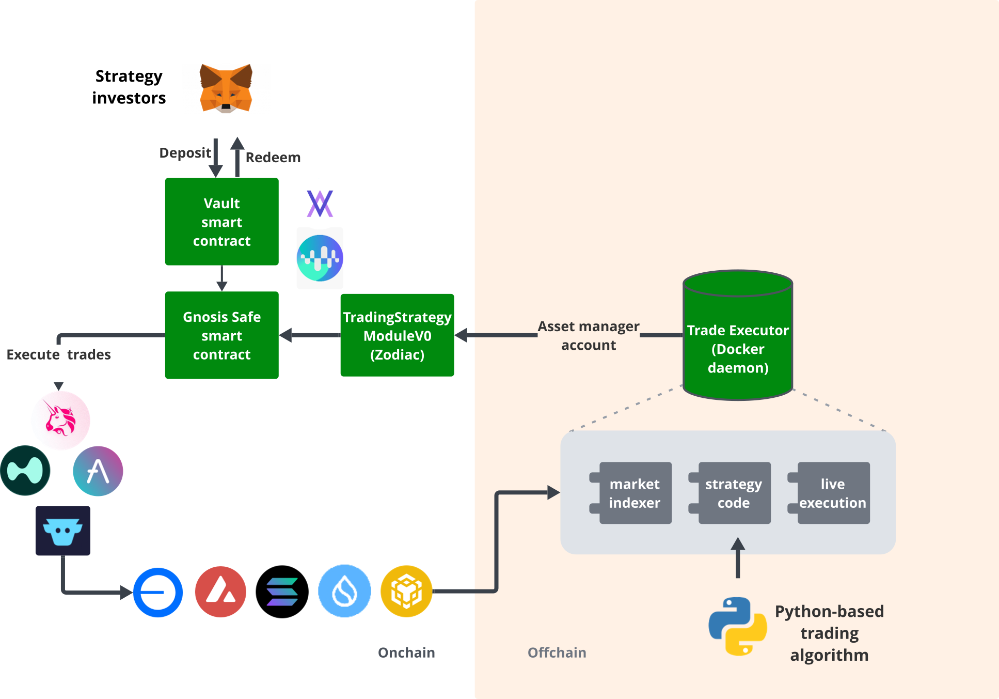

# Trading Strategy Zodiac-module for Safe multisignature wallets

[TradingStrategyModuleV0](./src/TradingStrategyModuleV0.sol) is a Zodiac-module for Gnosis Safe multisignature wallets.
It enables automated trading, or "trading algorithms" or "AI-agent", for various use cases,
where the algorithm has limited access rights to open and close trades with the capital secured in Gnosis Safe wallet.



The module lets an automated or discretionary asset manager propose trades. The onchain
`TradingStrategyModuleV0` checks each asset-manager call against the configured guard
rules before the Safe executes it. A narrow, reviewed configuration limits the impact of a
compromised asset manager; it does not make an arbitrary configuration or adapter safe.

- The main use case is enable safe algorithmic trading ("AI agents" or "trading bots") for vaults and private capital in Gnosis Safe wallets.
  The algorithm is hosted on [offchain oracles](https://github.com/tradingstrategy-ai/trade-executor/) called Trade Executors,
  which run the algorith logic in [Python](https://tradingstrategy.ai/glossary/python), and then submit the trades
  to the Safe wallet via this module using a special asset manager role.
- This is a [Zodiac framework-based](https://github.com/gnosisguild/zodiac) smart contract 
- The module is designed to be used with [Lagoon vaults](https://tradingstrategy.ai/glossary/lagoon),
  but it works with any Safe smart contract wallet or product
- This module is a guard-design pattern based smart contract, which has complex dynamic 
  logic to whitelist allowed trades (DEXes, trading pairs, lending protocols, assets and so on)
  limiting or eliminating the scope of the damage of what a compromised asset manager could do
- The module has Python-bindings (see [eth-defi package](https://github.com/tradingstrategy-ai/web3-ethereum-defi) and high level interface to construct trades offchain, 
  with a lot of developer experience and diagnostics tools, making it easy to use for offchain trading algorithms  
- For more information see [Trading Strategy website](https://tradingstrategy.ai)

**Note**: This code is not audited. The Zodiac-module smart contract is called [TradingStrategyModuleV0](./src/TradingStrategyModuleV0.sol) reflecting the Minimum Viable product nature of this work.

## Dependencies

Included as Github submodules

- Zodiac: main: https://github.com/gnosisguild/zodiac/tree/master/contractscd ..
- Safe> v1.3.0-1: https://github.com/safe-global/safe-smart-account/
- OpenZeppelin: release-v3.4: https://github.com/OpenZeppelin/openzeppelin-contracts

## Security boundaries

The [GuardV0 security model](../guard/README.md#security-model) defines the allowed
senders, call sites, assets and receivers. Product deployments must provide an explicit
asset list and keep `anyAsset` disabled. `anyAsset` remains available for development and
mainnet rehearsals, but its `approve()` bypass cannot validate the dynamic token target and
is unsafe as a product policy.

Lagoon Safes must have a zero Safe fallback handler. The deployment helpers encode and
verify that state, including when attaching to an existing Safe. Do not enable a fallback
handler later: Lagoon has no need for an additional authentication path alongside Zodiac
modules. The [Gnosis Pay post-mortem](https://www.gnosis.io/blog/post-mortem-gnosis-pay-vulnerability-exploit)
attributes the June 2026 incident to an ERC-1271 validation bug in Zodiac Delay and Roles,
not to a Safe fallback handler. Disabling the unused handler is therefore a deliberate
defence-in-depth measure, not a claim about the incident's root cause.

Uniswap V2/V3, CowSwap and Velora adapters are not approved for active product use until
they have an oracle-backed cumulative maximum-slippage policy.

## Rules and whitelists

- See [GuardBaseV0](../guard/src/GuardV0Base.sol) for the rule logic and supported protocols. 
- The protocols include, but are not limited to: Uniswap, Aave, ERC-4626, ERC-7540, Gains-like, 1delta. 

## How to use

- The code is designed to be used with offchain Python automation
- [See Lagoon integration code in eth-defi Python package](https://web3-ethereum-defi.readthedocs.io/api/lagoon/index.html)

## How repackage with Python package

In `eth-defi` root, run:

```shell
make guard safe-integration
```

This will regenerate ABI files to allow Python-based automation whitelist. 

## How to test deployment

```shell
# Runs all pytest-modules tagged for guard
pytest -k guard
```
