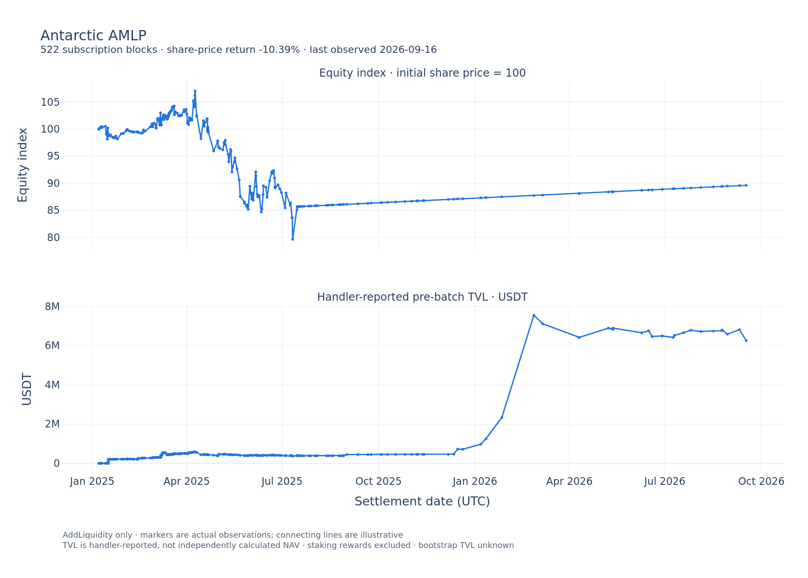
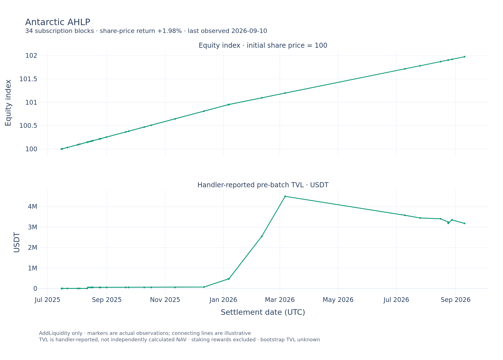

# Antarctic settlement chart snapshot

Generated on 2026-09-30 using authenticated Arbitrum Hypersync, through block `510301932` (exclusive query end `510301933`). These are full observed histories from the reviewed manager deployment blocks, read through the production Antarctic historical reader. Source logs include 635 AMLP subscriptions and 34 AHLP subscriptions; selecting the last AddLiquidity log in each block yields 522 and 34 chart observations respectively. Redemptions remain diagnostic and are excluded.

| Product | Last share price (USDT) | Return since first observation | Last reported pre-batch TVL (USDT) | Last observation (UTC) |
| --- | ---: | ---: | ---: | --- |
| AMLP | 0.89610482 | −10.39% | 6,253,637.18 | 2026-09-16 14:11:25 |
| AHLP | 1.01976449 | +1.98% | 3,182,499.72 | 2026-09-10 07:04:17 |

Equity starts at 100 at the initial subscription price. Staking rewards are excluded. TVL is handler-reported, not independently calculated NAV; bootstrap zero is unknown. Markers are actual observations and connecting lines are illustrative. These last observations are not a fresh valuation at the scan cutoff.





The CSV files retain sparse observation times, blocks, share prices, reported TVL and equity index. `summary.json` records the source cutoff and product identities. Reproduce with the normal RPC and Hypersync environment:

```shell
END_BLOCK=510301933 HYPERSYNC_RPM=20 poetry run python scripts/erc-4626/plot-antarctic-vaults.py
```

The script writes isolated caches and charts under `~/.cache/antarctic-charts` by default; `OUTPUT_DIR` can override this. PNG export requires Chrome for Plotly/Kaleido. Interactive HTML copies are generated locally and are not committed.
