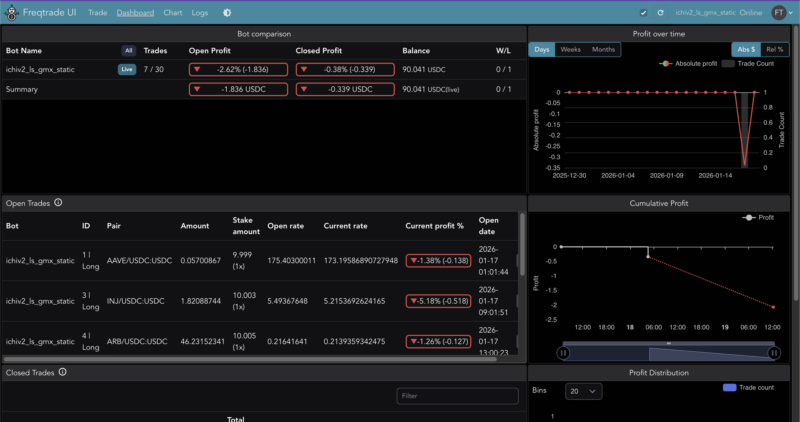
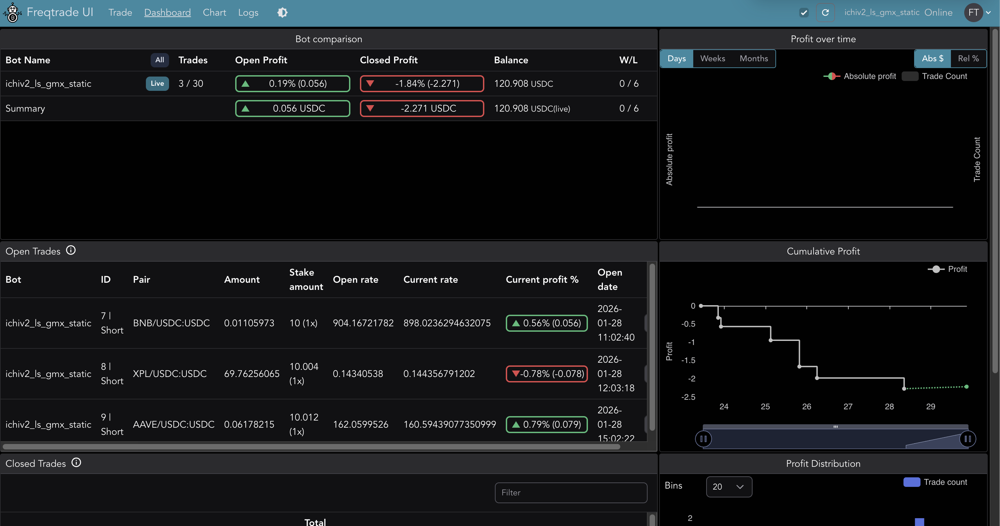
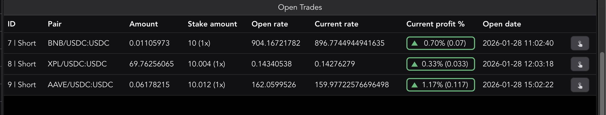
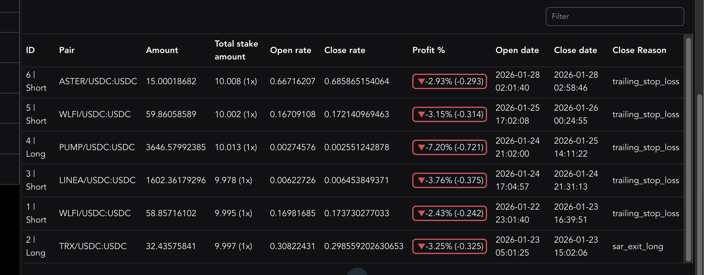

# GMX CCXT adapter for eth_defi

A [CCXT](https://docs.ccxt.com/)-compatible adapter enabling Python trading bots to interact with [GMX](https://gmx.io/), a decentralised perpetual futures exchange on Arbitrum. This module provides familiar CCXT-style methods for market data, position management, and order execution with support for all GMX order types.

**Note:** No API keys required - uses Web3 wallet authentication directly with GMX smart contracts.

For a complete trading bot example with Freqtrade, see the [gmx-ccxt-freqtrade tutorial](https://github.com/tradingstrategy-ai/gmx-ccxt-freqtrade).

## Key features

- **Full CCXT method compatibility** - `fetch_markets`, `fetch_ticker`, `create_order`, and 20+ methods
- **All order types** - Market, limit, stop-loss, take-profit orders
- **Bundled orders** - Open position + SL + TP in single atomic transaction
- **USD-based sizing** - Use `size_usd` parameter for position sizing in USD
- **Percentage triggers** - Configure SL/TP with `triggerPercent` relative to entry
- **Token swaps** - Direct token-to-token swaps via GMX liquidity pools
- **Historical OHLCV** - Candlestick data for backtesting (10,000 candle limit)
- **Funding rates** - Real-time and historical funding rate data
- **Open interest** - Market open interest by direction
- **Leverage** - Configurable leverage (1.0x to 100x per market)
- **Isolated margin** - GMX uses isolated margin mode
- **Freqtrade integration** - Monkeypatch for strategy backtesting and live trading
- **Arbitrum network** - Supports Arbitrum One (mainnet) and Arbitrum Sepolia (testnet)

## Quick start

### Installation

Install `web3-ethereum-defi` with data extras:

```bash
pip install "web3-ethereum-defi[data]"
```

Or with Poetry:

```bash
poetry add -E data web3-ethereum-defi
```

### Read-only mode (no wallet)

```python
from eth_defi.gmx.ccxt import GMX

# Initialise with RPC URL only
gmx = GMX({
    "rpcUrl": "https://arb1.arbitrum.io/rpc",
})

# Load markets
gmx.load_markets()

# Fetch current price
ticker = gmx.fetch_ticker("ETH/USDC:USDC")
print(f"ETH price: ${ticker['last']:,.2f}")

# Fetch OHLCV data
ohlcv = gmx.fetch_ohlcv("ETH/USDC:USDC", "1h", limit=100)
```

### Trading mode (with wallet)

```python
from eth_defi.gmx.ccxt import GMX

# Initialise with wallet for trading
gmx = GMX({
    "rpcUrl": "https://arb1.arbitrum.io/rpc",
    "privateKey": "0x...",  # Your wallet private key
})

gmx.load_markets()

# Open a 3x leveraged long position
order = gmx.create_market_buy_order(
    "ETH/USDC:USDC",
    0,  # Ignored when size_usd provided
    {
        "size_usd": 100,        # $100 position
        "leverage": 3.0,
        "collateral_symbol": "USDC",
    }
)
```

### Limit order (buy the dip)

```python
# Create limit order that triggers when price drops to $1900
order = gmx.create_limit_buy_order(
    "ETH/USDC:USDC",
    0,  # Ignored when size_usd provided
    1900.0,  # Trigger price
    {
        "size_usd": 100,
        "leverage": 3.0,
        "collateral_symbol": "USDC",
    }
)
# Order remains pending until ETH price reaches $1900
```

### Bundled SL/TP orders

```python
# Create position with stop-loss and take-profit in single transaction
order = gmx.create_order(
    "ETH/USDC:USDC",
    "market",
    "buy",
    0,
    None,
    {
        "size_usd": 100,
        "leverage": 3.0,
        "collateral_symbol": "USDC",
        "stopLoss": {"triggerPercent": 0.05},   # 5% below entry
        "takeProfit": {"triggerPercent": 0.10}, # 10% above entry
    }
)
# Creates 3 orders atomically: main position + SL + TP
```

### Token swap

```python
from eth_defi.gmx.config import GMXConfig
from eth_defi.gmx.order.swap_order import SwapOrder

# Swap USDC to ETH
swap = SwapOrder(
    config=config,
    start_token="0xaf88d065e77c8cC2239327C5EDb3A432268e5831",  # USDC
    out_token="0x82aF49447D8a07e3bd95BD0d56f35241523fBab1",   # WETH
)

# Estimate output
estimate = swap.estimate_swap_output(amount_in=100_000_000)  # 100 USDC
print(f"Expected output: {estimate['estimated_output_formatted']:.6f} ETH")

# Create swap order
result = swap.create_swap_order(amount_in=100_000_000, slippage_percent=0.005)
```

## Core trading (GMXTrading class)

The `GMXTrading` class provides the native Python API for trading operations. This is the underlying engine that powers the CCXT adapter.

```python
from eth_defi.gmx.trading import GMXTrading
from eth_defi.gmx.config import GMXConfig
from web3 import Web3

web3 = Web3(Web3.HTTPProvider("https://arb1.arbitrum.io/rpc"))
config = GMXConfig.from_private_key(web3, "0x...", chain="arbitrum")
trading = GMXTrading(config)
```

### Methods

| Method | Description |
|--------|-------------|
| `open_position(...)` | Open a leveraged long/short position at market price |
| `close_position(...)` | Close or reduce an existing position |
| `swap_tokens(...)` | Direct token-to-token swap using GMX liquidity pools |
| `open_limit_position(...)` | Open a position when trigger price is reached |
| `open_position_with_sltp(...)` | Open position with bundled stop-loss and take-profit orders |
| `create_stop_loss(...)` | Create standalone stop-loss order for existing position |
| `create_take_profit(...)` | Create standalone take-profit order for existing position |

### open_position example

```python
result = trading.open_position(
    market_symbol="ETH",
    collateral_symbol="USDC",
    start_token_symbol="USDC",
    is_long=True,
    size_delta_usd=100,  # $100 position
    leverage=3.0,
    slippage_percent=0.003,
)
```

### open_limit_position example

```python
# Buy ETH if price drops to $3000
result = trading.open_limit_position(
    market_symbol="ETH",
    collateral_symbol="ETH",
    start_token_symbol="ETH",
    is_long=True,
    size_delta_usd=1000,
    leverage=2.5,
    trigger_price=3000.0,
)
```

### open_position_with_sltp example

```python
result = trading.open_position_with_sltp(
    market_symbol="ETH",
    collateral_symbol="USDC",
    start_token_symbol="USDC",
    is_long=True,
    size_delta_usd=100,
    leverage=3.0,
    stop_loss_percent=0.05,   # 5% stop-loss
    take_profit_percent=0.10, # 10% take-profit
)
# Returns SLTPOrderResult with main order, SL order, and TP order
```

### swap_tokens example

```python
result = trading.swap_tokens(
    in_token_symbol="USDC",
    out_token_symbol="ETH",
    amount=100_000_000,  # 100 USDC (6 decimals)
    slippage_percent=0.02,
)
```

### create_stop_loss / create_take_profit example

```python
# Create standalone SL 5% below entry
sl_result = trading.create_stop_loss(
    market_symbol="ETH",
    collateral_symbol="ETH",
    is_long=True,
    position_size_usd=1000,
    entry_price=3000.0,
    stop_loss_percent=0.05,
)

# Create standalone TP 10% above entry
tp_result = trading.create_take_profit(
    market_symbol="ETH",
    collateral_symbol="ETH",
    is_long=True,
    position_size_usd=1000,
    entry_price=3000.0,
    take_profit_percent=0.10,
)
```

## Order types

GMX supports 7 order types:

| Order Type | GMX ID | Description | Method |
|------------|--------|-------------|--------|
| MARKET_SWAP | 0 | Immediate token swap | `SwapOrder.create_swap_order()` |
| LIMIT_SWAP | 1 | Token swap at limit price | Not implemented |
| MARKET_INCREASE | 2 | Open/increase position at market | `IncreaseOrder.create_increase_order()` |
| LIMIT_INCREASE | 3 | Open/increase at trigger price | `IncreaseOrder.create_limit_increase_order()` |
| MARKET_DECREASE | 4 | Close/decrease at market | `DecreaseOrder.create_decrease_order()` |
| LIMIT_DECREASE | 5 | Take-profit order | `SLTPOrder.create_take_profit_order()` |
| STOP_LOSS_DECREASE | 6 | Stop-loss order | `SLTPOrder.create_stop_loss_order()` |

### Market orders

Immediate execution at current market price.

```python
# Long position
order = gmx.create_market_buy_order(
    "ETH/USDC:USDC",
    0,
    {"size_usd": 1000, "leverage": 3.0, "collateral_symbol": "USDC"},
)

# Short position
order = gmx.create_market_sell_order(
    "BTC/USDC:USDC",
    0,
    {"size_usd": 500, "leverage": 2.0, "collateral_symbol": "USDC"},
)

# Close position
order = gmx.create_order(
    "ETH/USDC:USDC",
    "market",
    "sell",  # Opposite of position direction
    0,
    None,
    {"size_usd": 1000, "reduceOnly": True},
)
```

### Limit orders

Execute when market price reaches trigger price. Order remains pending until conditions are met.

- **Long limit:** Trigger price BELOW current price (buy the dip)
- **Short limit:** Trigger price ABOVE current price (sell the rally)

```python
# CCXT style
order = gmx.create_limit_buy_order(
    "ETH/USDC:USDC",
    0,
    1900.0,  # Trigger price
    {"size_usd": 1000, "leverage": 3.0, "collateral_symbol": "USDC"},
)

# Native GMX style
from eth_defi.gmx.trading import GMXTrading
trading = GMXTrading(config)
order = trading.open_limit_position(
    market_symbol="ETH",
    collateral_symbol="USDC",
    is_long=True,
    size_delta_usd=1000,
    leverage=3.0,
    trigger_price=1900.0,
)
```

### Stop-loss orders

Trigger when price moves AGAINST position. Prioritises execution over price protection (no slippage).

```python
from eth_defi.gmx.order.sltp_order import SLTPOrder, SLTPEntry

sltp = SLTPOrder(config, market_key, collateral_addr, index_token, is_long=True)
result = sltp.create_stop_loss_order(
    position_size_usd=1000,
    entry=SLTPEntry(trigger_percent=0.05),  # 5% below entry
    entry_price=2000.0,
)
```

### Take-profit orders

Trigger when price moves IN FAVOUR of position. Slippage protection applied.

```python
result = sltp.create_take_profit_order(
    position_size_usd=1000,
    entry=SLTPEntry(trigger_percent=0.10),  # 10% above entry
    entry_price=2000.0,
)
```

### Bundled orders (SL/TP with entry)

Create position + SL + TP in single atomic transaction. Lower gas costs and guaranteed SL/TP placement.

```python
# Percentage-based triggers
order = gmx.create_order(
    "ETH/USDC:USDC",
    "market",
    "buy",
    0,
    None,
    {
        "size_usd": 1000,
        "leverage": 3.0,
        "collateral_symbol": "USDC",
        "stopLoss": {"triggerPercent": 0.05},
        "takeProfit": {"triggerPercent": 0.10},
    },
)

# Absolute price triggers
order = gmx.create_order(
    "ETH/USDC:USDC",
    "market",
    "buy",
    0,
    None,
    {
        "size_usd": 1000,
        "leverage": 3.0,
        "collateral_symbol": "USDC",
        "stopLossPrice": 1850.0,
        "takeProfitPrice": 2200.0,
    },
)
```

## CCXT adapter

The GMX module provides a full [CCXT](https://docs.ccxt.com/)-compatible adapter for seamless integration with trading bots and the Freqtrade framework.

**For detailed CCXT documentation, see [ccxt/README.md](ccxt/README.md)**

### Key CCXT methods

- **Market data:** `fetch_markets`, `fetch_ticker`, `fetch_ohlcv`, `fetch_trades`, `fetch_currencies`
- **Account:** `fetch_balance`, `fetch_positions`, `fetch_open_orders`, `fetch_my_trades`
- **Trading:** `create_order`, `create_market_buy_order`, `create_limit_order`, `set_leverage`
- **Derivatives:** `fetch_funding_rate`, `fetch_open_interest`, `fetch_leverage_tiers`

### GMX-specific extensions

The adapter extends standard CCXT with GMX-specific parameters:

| Parameter | Description |
|-----------|-------------|
| `size_usd` | Position size in USD (alternative to base currency amount) |
| `leverage` | Leverage multiplier (1.0x to 100x) |
| `collateral_symbol` | Collateral token symbol (e.g., "USDC", "ETH") |
| `stopLoss` | Stop-loss config: `{triggerPercent}` or `{triggerPrice}` |
| `takeProfit` | Take-profit config: `{triggerPercent}` or `{triggerPrice}` |

See [ccxt/README.md](ccxt/README.md) for complete method reference and examples.

## Freqtrade integration

The GMX adapter is injected into Freqtrade via monkeypatch:

1. Patches CCXT to add `ccxt.gmx` and `ccxt.async_support.gmx`
2. Registers `Gmx` class in Freqtrade's exchange module
3. Adds 'gmx' to `SUPPORTED_EXCHANGES` list

No modifications to Freqtrade or CCXT source code required.

### What is freqtrade-gmx?

The `freqtrade-gmx` script is a **wrapper that applies the GMX monkeypatch before starting Freqtrade**. It is required because the patch must be applied **before** Freqtrade modules are imported.

**How it works:**
1. Activates the Python virtual environment
2. Runs `eth_defi.gmx.freqtrade.patched_entrypoint` module
3. Applies the GMX monkeypatch to CCXT and Freqtrade
4. Forwards all arguments to Freqtrade

**Important:** You cannot use the plain `freqtrade` command with GMX - you must use `./freqtrade-gmx` wrapper or apply the patch programmatically.

### Setting up freqtrade-gmx

See the [gmx-ccxt-freqtrade repository](https://github.com/tradingstrategy-ai/gmx-ccxt-freqtrade) for complete setup instructions.

```bash
# Clone the repository with submodules
git clone --recurse-submodules https://github.com/tradingstrategy-ai/gmx-ccxt-freqtrade.git
cd gmx-ccxt-freqtrade

# Create virtual environment
python3.11 -m venv .venv
source .venv/bin/activate

# Install dependencies
pip install -r freqtrade-develop/requirements.txt
pip install -e freqtrade-develop/
pip install -e "deps/web3-ethereum-defi[data]"

# Verify installation
./freqtrade-gmx --version
```

### Configuration example

```json
{
    "exchange": {
        "name": "gmx",
        "ccxt_config": {
            "rpcUrl": "${JSON_RPC_ARBITRUM}",
            "privateKey": "${PRIVATE_KEY}",
            "executionBuffer": 2.5, // This ensures that the multicalls on GMX doesn't run out of gas
            "options": {
                "graphql_only": false
            }
        },
        "pair_whitelist": ["ETH/USDC:USDC", "BTC/USDC:USDC"]
    },
    "stake_currency": "USDC",
    "trading_mode": "futures",
    "margin_mode": "isolated",
    "order_types": {
        "entry": "market",
        "exit": "market",
        "stoploss": "market",
        "stoploss_on_exchange": true
    }
}
```

### Running Freqtrade with GMX

```bash
# Use the wrapper script that applies monkeypatch
./freqtrade-gmx --version

# Download historical data
./freqtrade-gmx download-data \
  --config configs/my_config.json \
  --exchange gmx \
  --timeframe 1h \
  --timerange 20250701-20251208

# Run backtest
./freqtrade-gmx backtesting \
  --config configs/my_config.json \
  --strategy MyStrategy \
  --timerange 20250701-20251208

# Dry-run live trading
./freqtrade-gmx trade \
  --config configs/my_config.json \
  --config configs/my_config.secrects.json
  --strategy MyStrategy \
  --dry-run

# Live trade
./freqtrade-gmx trade \
  --config configs/my_config.json \
  --config configs/my_config.secrects.json \
  --strategy MyStrategy
```

### Live Trading With Custom Strategy

#### Dashboard





#### Trades


#### Open Trades



#### Order History




### Programmatic patching

```python
from eth_defi.gmx.freqtrade.monkeypatch import patch_freqtrade

# Apply patch before importing Freqtrade modules
patch_freqtrade()

from freqtrade.resolvers import ExchangeResolver
exchange = ExchangeResolver.load_exchange(config)
```

## Limitations

**Note:** These are protocol-level limitations, not implementation gaps:

| Limitation | Description | Documentation |
|------------|-------------|---------------|
| No order book | GMX uses [liquidity pools](https://docs.gmx.io/docs/providing-liquidity), not order books | [Providing Liquidity](https://docs.gmx.io/docs/providing-liquidity) |
| No order cancellation | Executed orders cannot be cancelled (keeper-executed) | [API Contracts](https://docs.gmx.io/docs/api/contracts) |
| No volume data | OHLCV volume always 0 (GMX API only provides OHLC + timestamp) | [Candles API](https://arbitrum-api.gmxinfra.io/prices/candles?tokenSymbol=ETH&period=1d&limit=3) |
| OHLCV limit | Historical data limited to ~10,000 candles per request | [Candlesticks](https://docs.gmx.io/docs/api/rest#candlesticks) |
| Isolated margin only | Cross margin not supported by GMX | [Trading](https://docs.gmx.io/docs/trading) |
| Keeper execution | Orders execute via [keeper network](https://docs.gmx.io/docs/api/contracts), not instantly | [API Contracts](https://docs.gmx.io/docs/api/contracts) |
| 24h stats calculated | Ticker 24h high/low/open are calculated from OHLCV candles, not provided natively by GMX API (unlike centralised exchanges that track these in real-time) | - |

## Example scripts

Example scripts are available in [`scripts/gmx/`](../../scripts/gmx/):

### Trading operations

| Script | Description |
|--------|-------------|
| [`gmx_open_position.py`](../../scripts/gmx/gmx_open_position.py) | Open leveraged position (native API) |
| [`gmx_close_position.py`](../../scripts/gmx/gmx_close_position.py) | Close existing position |
| [`gmx_limit_order.py`](../../scripts/gmx/gmx_limit_order.py) | Create limit order (native API) |
| [`gmx_ccxt_limit_order.py`](../../scripts/gmx/gmx_ccxt_limit_order.py) | Create limit order (CCXT style) |
| [`gmx_stop_loss_order.py`](../../scripts/gmx/gmx_stop_loss_order.py) | Standalone stop-loss order |
| [`gmx_take_profit_order.py`](../../scripts/gmx/gmx_take_profit_order.py) | Standalone take-profit order |
| [`gmx_ccxt_sltp_order.py`](../../scripts/gmx/gmx_ccxt_sltp_order.py) | Bundled position + SL + TP |
| [`gmx_swap.py`](../../scripts/gmx/gmx_swap.py) | Token swap |
| [`gmx_close_all_positions.py`](../../scripts/gmx/gmx_close_all_positions.py) | Batch close all positions |

### CCXT interface examples

| Script | Description |
|--------|-------------|
| [`gmx_ccxt_order_creation.py`](../../scripts/gmx/gmx_ccxt_order_creation.py) | CCXT-style order creation |
| [`gmx_ccxt_style_order_creation.py`](../../scripts/gmx/gmx_ccxt_style_order_creation.py) | CCXT initialisation pattern |
| [`gmx_ccxt_market_data.py`](../../scripts/gmx/gmx_ccxt_market_data.py) | Market data methods (ticker, trades) |
| [`gmx_ccxt_ohlcv.py`](../../scripts/gmx/gmx_ccxt_ohlcv.py) | OHLCV candlestick data |
| [`gmx_ccxt_positions.py`](../../scripts/gmx/gmx_ccxt_positions.py) | Position management |
| [`gmx_ccxt_trading.py`](../../scripts/gmx/gmx_ccxt_trading.py) | Balance and trade history |
| [`gmx_ccxt_funding_rates.py`](../../scripts/gmx/gmx_ccxt_funding_rates.py) | Funding rate data |
| [`gmx_ccxt_open_interest.py`](../../scripts/gmx/gmx_ccxt_open_interest.py) | Open interest data |

### Market data and analysis

| Script | Description |
|--------|-------------|
| [`gmx_fetch_markets.py`](../../scripts/gmx/gmx_fetch_markets.py) | Fetch available markets |
| [`gmx_get_open_positions.py`](../../scripts/gmx/gmx_get_open_positions.py) | Query open positions |
| [`gmx_graphql_positions.py`](../../scripts/gmx/gmx_graphql_positions.py) | GraphQL position queries |
| [`gmx_event_parsing.py`](../../scripts/gmx/gmx_event_parsing.py) | Parse blockchain events |
| [`gmx_trade_history.py`](../../scripts/gmx/gmx_trade_history.py) | Trade history analysis |
| [`gmx_ohlc_dump.py`](../../scripts/gmx/gmx_ohlc_dump.py) | Dump OHLC to Parquet |

## Testing

```bash
# Run all GMX tests
source .local-test.env && poetry run pytest tests/gmx/ -v

# Run specific test file
source .local-test.env && poetry run pytest tests/gmx/test_trading.py -v

# Run CCXT integration tests
source .local-test.env && poetry run pytest tests/gmx/ccxt/ -v
```

## Supported networks

| Network | Chain ID | RPC environment variable |
|---------|----------|-------------------------|
| Arbitrum One (mainnet) | 42161 | `JSON_RPC_ARBITRUM` |
| Arbitrum Sepolia (testnet) | 421614 | `ARBITRUM_SEPOLIA_RPC_URL` |

**Note:** Testnet uses RPC mode for market loading (REST API only supports mainnet).

## Environment variables

| Variable | Description |
|----------|-------------|
| `JSON_RPC_ARBITRUM` | Arbitrum mainnet RPC URL |
| `ARBITRUM_SEPOLIA_RPC_URL` | Arbitrum Sepolia testnet RPC |
| `PRIVATE_KEY` | Wallet private key for trading |
| `GMX_DISABLE_MARKET_CACHE` | Set to "true" to disable market caching |

## See also

- [GMX Freqtrade Tutorial](https://github.com/tradingstrategy-ai/gmx-ccxt-freqtrade) - Complete trading bot example
- [GMX Protocol Documentation](https://docs.gmx.io/)
- [GMX Synthetics Contracts](https://github.com/gmx-io/gmx-synthetics)
- [CCXT Documentation](https://docs.ccxt.com/)
- [Freqtrade Documentation](https://www.freqtrade.io/)
