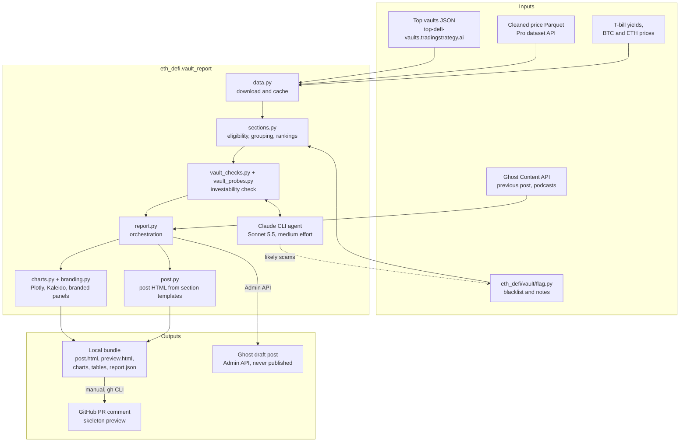

# The best-performing stablecoin vaults: blog post drafts

This document explains why and how we generate the draft of the monthly
[*The best-performing stablecoin vaults*](https://tradingstrategy.ai/blog/the-best-performing-stablecoin-vaults-february-2026)
blog post, how a draft is previewed as a GitHub pull request comment, and how
the actual draft is created in Ghost. For the operator guide, environment
variables and data sources see [`README-vault-report.md`](README-vault-report.md);
for the post structure and selection rules see
[`README-blog-post-outline.md`](README-blog-post-outline.md).

## Goal

The monthly report ran by hand from June 2025 to February 2026: someone ran a
notebook and copy-pasted its tables and chart screenshots into Ghost, which took
most of a day and stopped the series. The goal is a **blog post skeleton**: every
data-driven part of the post generated in the website's visual identity, so the
editor only writes the monthly news and commentary.

The skeleton keeps the structure of the earlier posts:

- the opening paragraph and the Ghost theme's table of contents
  (`<div id="table-of-contents"></div>` in an HTML card);
- the introduction sections *About the report* and *Report content updates*,
  with this month's figures in bold: blockchains, protocols, vaults and TVL;
- *DeFi vault community news* and *Latest podcasts* before the data sections;
- the data sections, each with an introduction paragraph linking to the live
  pages on [tradingstrategy.ai](https://tradingstrategy.ai/vaults), section notes,
  charts and tables: *The best-performing vaults*, *Average yield*, *Risk and
  return*, and *Vaults and tokenised funds TVL* with the inflows and outflows
  last;
- *Partners* and *Next steps*, the call to action, copied from the previous
  post so the editor's wording carries over month to month.

Yellow ✏️ **EDITOR** and **TODO** callouts mark the parts a human writes; the
editor replaces them and deletes the callouts before publishing. The feature
image is also left for the editor. An agent-driven investability check removes
vaults that are not investable in practice before anything is ranked, see
*Investability check* in `README-vault-report.md`. The post does not list
them: a dated Markdown file in `eth_defi/vault_report/excluded-vaults/` records
them, and it is also posted as a comment on the report's pull request. The
editorial rules the generator follows are listed under *Writing rules* in
[`README-blog-post-outline.md`](README-blog-post-outline.md#writing-rules).

## Architecture



`scripts/erc-4626/generate-monthly-vault-report.py` runs the pipeline. Its
output is an unpublished draft post in Ghost. It also writes the same content
to a local bundle in `OUTPUT_DIR` for review and debugging.

## Running the exporter

```shell
source .local-test.env && \
    OUTPUT_DIR=/tmp/vault-report \
    VAULT_CHECK_AGENT=claude \
    poetry run python scripts/erc-4626/generate-monthly-vault-report.py
```

The script prints the Ghost editor link of the draft. Without a usable
`GHOST_ADMIN_API_KEY` it stops at startup with instructions, see
[Ghost post draft](#ghost-post-draft). With the investability check on
Sonnet 5.5, a run took about 5 minutes on 2026-09-30; without the check,
about 40 seconds.

To iterate on the post text or charts without paying for another agent run,
reuse the decisions of the previous bundle and replace the draft, as long as
nobody has edited it in Ghost yet. Reuse works while the downloaded data and
`flag.py` are unchanged: the downloads are cached for six hours, and the
decisions are tied to the exact candidate lists by a digest.

```shell
source .local-test.env && \
    OUTPUT_DIR=/tmp/vault-report-2 \
    VAULT_CHECK_AGENT=reuse VAULT_CHECK_DECISIONS=/tmp/vault-report \
    GHOST_OVERWRITE_DRAFT=true \
    poetry run python scripts/erc-4626/generate-monthly-vault-report.py
```

For a local preview only, e.g. when changing the templates, set
`GHOST_DRAFT=false` and open `preview.html` in the bundle.

## Ghost post draft

The actual post is created as an unpublished draft that the editor finishes in
the Ghost editor.

1. Create a *custom integration* in Ghost Admin (*Settings → Integrations*)
   and copy its **Admin API key**, `{id}:{secret}`, or copy the *Staff access
   token* from your staff user profile. The Content API key used to read the
   previous post and the podcasts is read-only and cannot create drafts; the
   script recognises one given by mistake and stops with instructions.
2. Put the key in your secrets file outside the repository, e.g.
   `~/local-test.env`, as `GHOST_ADMIN_API_KEY`. Never commit it or paste it
   into logs, chats or PR comments.
3. Run the exporter. `GHOST_ADMIN_API_URL` defaults to `GHOST_CONTENT_API_URL`.

The pipeline then, in `report.publish_report_draft()`:

- checks first that the slug, e.g. `the-best-performing-stablecoin-vaults-september-2026`,
  is free or holds a draft that may be replaced, so nothing is uploaded for a
  run that would fail;
- uploads the charts, the hero image and the podcast logos to Ghost;
- creates the post with `?source=html`, so Ghost converts the HTML into its
  editor cards: the table of contents, tables and podcast cards are HTML cards
  (`<!--kg-card-begin: html-->`), and editor notes are yellow callout cards;
- leaves the feature image empty for the editor, `hero.png` in the bundle being
  a ready-made option, and writes the editor link to `report.json` and the
  script output.

Safety rules, see `GhostAdminClient.fetch_writable_draft()`:

- the draft is **never published**: publishing is a manual step in Ghost;
- a published or scheduled post with the same slug is never touched;
- an existing draft is replaced only with `GHOST_OVERWRITE_DRAFT=true`,
  because replacing it loses edits made in Ghost. Use it while iterating on a
  draft nobody has edited yet.

## GitHub pull request comment drafts

While no Admin API key was available, and for reviewers without Ghost access, the
skeleton was previewed as a comment on the pull request, e.g.
[the PR #1600 skeleton comment](https://github.com/tradingstrategy-ai/web3-ethereum-defi/pull/1600#issuecomment-5846041620).
It shows the post in order, with the charts, the first three rows of each
table, the section notes collapsed and the editor callouts as quotes, followed
by an editor checklist and a summary of the check run. It is a review aid only:
Ghost never reads it.

The steps:

1. **Generate a bundle** with the exporter and `GHOST_DRAFT=false`, or reuse the
   bundle of a run that created the Ghost draft.
2. **Convert it to Markdown.** Headings, introductions and section notes come
   from `post.html`, tables from `tables/*.csv`, and the check results from
   `report.json` and the `vault-check-decisions-*.json` files. The comment uses
   `#` for its title, `##` for the post title, the editor checklist and the
   check run, and `###`/`####` for the post's sections and subsections, with
   an index of in-page links at the top. GitHub does not reliably give comment
   headings anchor ids, so each heading gets an explicit
   `<a name="slug"></a>` anchor. The converter so far has been a one-off
   script per review round; it is not in the repository.
3. **Upload the images** to an orphan branch of the pull request, e.g.
   `pr-1600-assets`, so the comment can show them without committing binaries
   to the feature branch. Git plumbing with a temporary index writes the
   commit without touching the working tree:

   ```shell
   git fetch -q origin pr-1600-assets
   export GIT_INDEX_FILE=/tmp/assets-index && rm -f $GIT_INDEX_FILE
   git read-tree origin/pr-1600-assets
   for f in /tmp/vault-report/charts/*.png /tmp/vault-report/hero.png; do
       blob=$(git hash-object -w "$f")
       git update-index --add --cacheinfo 100644,$blob,draft-sep30/$(basename $f)
   done
   commit=$(git commit-tree $(git write-tree) -p origin/pr-1600-assets -m "Add skeleton charts")
   git push -q origin "${commit}:refs/heads/pr-1600-assets"
   unset GIT_INDEX_FILE
   ```

   Link the images by commit, not by branch name, so later uploads cannot
   change an older comment:
   `https://raw.githubusercontent.com/tradingstrategy-ai/web3-ethereum-defi/<commit>/draft-sep30/risk_return.png`.
4. **Post or update the comment in place**, so the pull request keeps one
   current skeleton:

   ```shell
   gh api -X PATCH repos/tradingstrategy-ai/web3-ethereum-defi/issues/comments/<comment-id> -F body=@skeleton.md
   ```

   Create it the first time with `gh pr comment <pr> --body-file skeleton.md`.
   Check afterwards that every image URL returns 200 and every index link has
   a matching anchor.

## Editor workflow

1. Run the exporter with the investability check and the Admin API key.
2. Review the check's `uncertain` decisions and any new `flag.py` blacklist
   entries; commit the reviewed entries.
3. Open the draft from the editor link, fill in the ✏️ callouts, delete them,
   and publish from Ghost.
4. Attach `hero-square.png` when posting on X.
